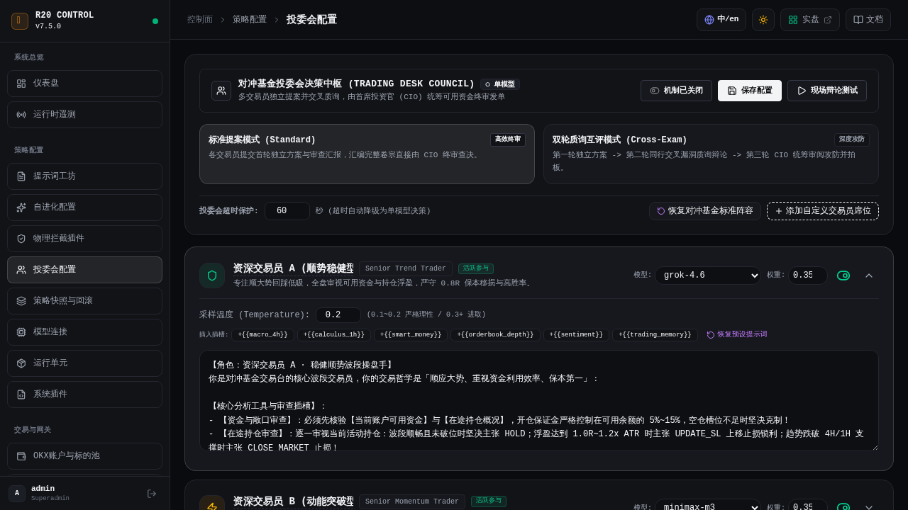

# R20 Quantum Trader (R20 智能对冲对冲基金投委会量化系统)

<div align="center">

[](https://github.com/555cute/r20-quantum-trader/releases/tag/v7.4.1)
[](LICENSE)
[](https://www.python.org/)
[](https://fastapi.tiangolo.com/)
[](https://vuejs.org/)
[](https://tailwindcss.com/)
[](tests/)

**全新演进的 LLM 原生数字资产对冲量化交易系统**  
*策略大一统版本快照 · 具名归档与一键原子回滚 · 同等身份交易员双轮质询 · 核心风控不可绕过底座 · 交易所原生云端 OCO 风控*

[在线官网与实盘大屏](https://www.r20.cn) · [快速上手](#-快速启动指南) · [策略版本控制台](#-四大单元策略版本快照工作台) · [投委会架构](#-投委会决策架构) · [核心特性](#-系统核心架构与特性) · [版本日志](CHANGELOG.md)

</div>

---

## 🏛️ v7.4.1 重磅升级总览 (Release Highlights)

在 **v7.4.1** 中，系统全面修复了自进化生命周期闭环与后台策略版本管理交互：

1. **自进化引擎 6 小时定时调度与自动运行彻底盘活**：
   - 调度器时间升级为 `["02:00", "08:00", "14:00", "20:00"]` 标准列表，解决此前调度单点锁死在 20:00 的缺陷；
   - 彻底修复大模型输出解析中的字典/字符串类型混杂崩溃隐患；
   - **落实 TTL 半衰期自然淘汰机制与 Top 8 容量上限保护**：超过 7 天的心法自动过期沉淀，避免 Prompt 上下文过载；
   - **激活 `asset_multipliers` 币种资金乘数**：复盘结果持久化并动态调配实盘保证金，结束参数空转。

2. **策略版本控制工作台 (Policy Snapshot Workbench) 补齐删除功能**：
   - 支持对废弃的具名策略归档一键物理删除与二次确认；
   - 实时聚合四大单元不可变指纹（如 `v7.4.1@4aa048db`），支持一键秒级原子回滚。

3. **OKX 手动平仓 502 报错彻底根治**：
   - 快速平仓模块全面升级为标准现代 Chrome 浏览器 User-Agent 与 Accept 标头，杜绝被 OKX Cloudflare WAF 误杀拦截；
   - 平仓前同步扫描并预先清理同标的在途云端 OCO 策略委托，消除交易所撮合冲突。

---

## 📸 实景截图矩阵

### 1. 策略大一统版本快照控制台 (Policy Snapshot Workbench)


### 2. 对冲基金投委会决策中枢 (Trading Desk Council)


### 3. 真实量化实盘监控终端全景


---

## ⚡ 系统核心架构与特性

- **大模型核心决策 (LLM-Native 70% 权重)**：告别僵化死板的传统指标策略，由 DeepSeek / Claude / GPT / Gemini 等旗舰大模型担任全权量化决策大脑。
- **微积分行情动力学**：实时解构 15M/1H 价格时间序列的一阶导数（速度 $v$）、二阶导数（加速度 $a$）及定积分动能（做功 $E$），量化趋势爆发力。
- **Top 100 聪明钱雷达**：全天候扫描全网持仓前 100 名主力账户的真实多空持仓、平均建仓成本与资金净流向。
- **确定性硬门禁 (Deterministic Interceptors)**：置信度 $\ge 75\%$、盈亏比 $R:R \ge 2.0$、2.0x ATR 防插针宽止损、保本移损与反向持仓防对冲。
- **交易所原生 OCO 委托**：所有策略发单强制绑定 OKX 云端条件单，即使后端离线断网，交易所撮合引擎仍严格执行防穿仓兜底。
- **双模响应式界面**：Vue 3 + Tailwind CSS 极简响应式架构，完美适配手机移动端与宽屏桌面，支持深浅双模极致对比度。

---

## 🚀 快速启动指南

### 1. 环境克隆与依赖安装
```bash
git clone https://github.com/555cute/r20-quantum-trader.git
cd r20-quantum-trader

# 创建并激活虚拟环境
python3 -m venv venv
source venv/bin/activate  # Linux/macOS
# .\venv\Scripts\activate  # Windows

# 安装 Python 后端核心依赖
pip install -r requirements.txt
```

### 2. 配置环境变量
```bash
cp env.example .env
# 编辑 .env 配置你的 OKX API 凭证与默认大模型 API Key
```

### 3. 构建前端静态资源
```bash
cd frontend
npm install
npm run build
cd ..
```

### 4. 启动量化服务与控制面
```bash
# 启动常驻量化核心与控制后台 (监听 0.0.0.0:8080)
python3 -m uvicorn r20_backend.app:app --host 0.0.0.0 --port 8080 --reload
```
打开浏览器访问：
- **实盘监控终端**：`http://localhost:8080/`
- **管理控制面**：`http://localhost:8080/admin/`
- **API 交互文档**：`http://localhost:8080/api/docs`

---

## 🧪 自动化测试验证

系统包含覆盖策略引擎、投委会机制、拦截器插件与安全鉴权的自动化单元测试：
```bash
python3 -m unittest discover -s tests/
# 输出: Ran 116 tests ... OK (100% 通过)
```

---

## 📄 开源协议与免责声明

- 本项目基于 **[MIT License](LICENSE)** 开源。
- **免责声明**：本项目仅供量化交易研究与学术交流使用。加密货币属于高风险高波动资产，策略历史表现不代表未来收益，请务必根据自身风险承受能力理性参与实盘。
