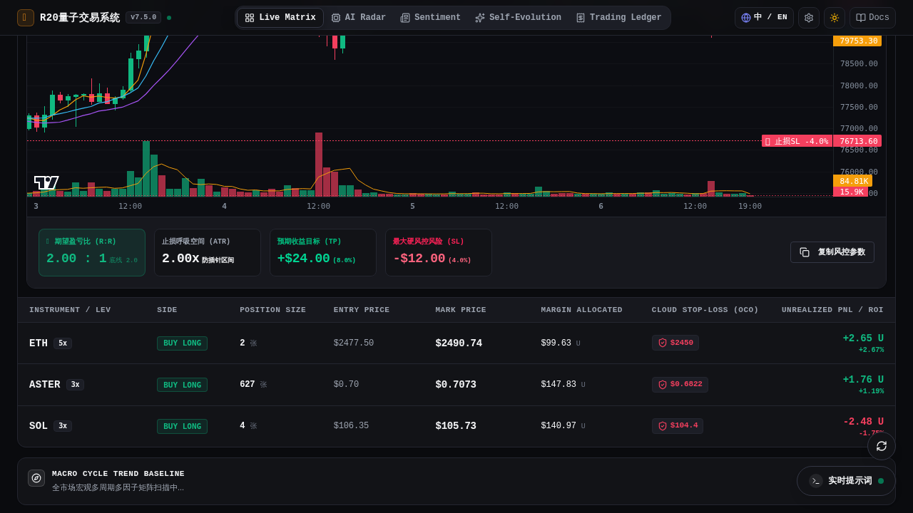
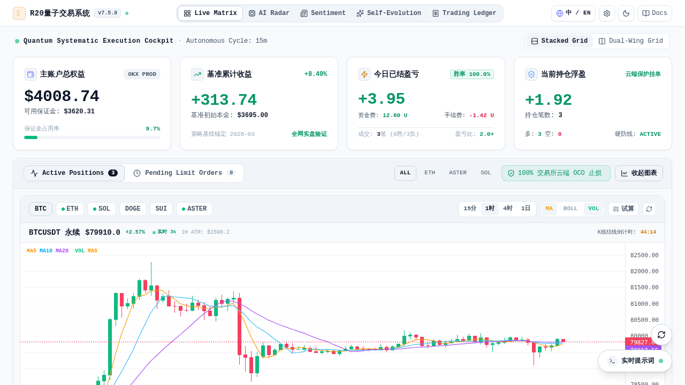

# R20 量子交易系统 (R20 Quantum Trading System)

<div align="center">

```
  ____ ____   ___    ___                  _                    _____             _ _             
 |  _ \___ \ / _ \  / _ \ _   _  __ _ _ __| |_ _   _ _ __ ___  |_   _| __ __ _  __| (_)_ __   __ _ 
 | |_) |__) | | | || | | | | | |/ _` | '__| __| | | | '_ ` _ \   | || '__/ _` |/ _` | | '_ \ / _` |
 |  _ </ __/| |_| || |_| | |_| | (_| | |  | |_| |_| | | | | | |  | || | | (_| | (_| | | | | | (_| |
 |_| \_\_____|\___/  \__\_\\__,_|\__,_|_|   \__|\__,_|_| |_| |_|  |_||_|  \__,_|\__,_|_|_| |_|\__, |
                                                                                               |___/ 
```

[](https://github.com/555cute/r20-quantum-trader/releases/tag/v7.5.0)
[](LICENSE)
[](https://www.python.org/)
[](https://fastapi.tiangolo.com/)
[](https://vuejs.org/)
[](https://github.com/tradingview/lightweight-charts)
[](tests/)

**新一代机构级加密货币波段量化决策与执行系统 · AI 投委会大模型驱动**  
*本地直连 TradingView 工业引擎 · 视觉 LLM 友好型量价形态图表 · 2x2 移动端专业卡舱 · 交易所原生云端 OCO 风控*

[系统全景](#-系统设计哲学与核心理念) · [实机一览](#-实机界面一览) · [架构拓扑](#-系统全景架构拓扑) · [核心模块](#-六大核心系统能力) · [快速上手](#-快速启动指南) · [发行版日志](https://github.com/555cute/r20-quantum-trader/releases)

<br/>

> 💬 **官方交流 QQ 群**：**`655973677`** ｜ 欢迎量化极客、提示词工程师、大模型 Agent 开发者进群交流探讨实战心得！

</div>

---

## 📸 实机界面一览

### 1. 暗色极客操盘台（Bento 资产舱 + 资金费/手续费透传 + TradingView 150 根饱满蜡烛）


### 2. 视觉 LLM 友好型多指标共存工作站（MA + BOLL + VOL 高对比度无遮挡）


### 3. 亮色全息操盘大屏（0 阴影遮罩 · 纯净透亮）


---

## 🌟 系统设计哲学与核心理念

传统量化交易软件往往陷入两大误区：要么是**逻辑写死的机械黑盒**，缺乏应对突发宏观风险与复杂博弈的感知能力；要么是**完全迷信未经约束的大模型**，导致严重的 AI 幻觉和本金大幅回撤。

**R20 量子交易系统 (R20 Quantum Trading System)** 致力于将**「前沿多模型 AI 认知推理」**与**「不可穿透的物理级量化风控（Fail-Closed）」**深度融合，构建起专属于专业交易员的波段量化决策闭环：

1. **认知决策归模型，物理风控归底座**：
   - 宏观趋势推演、微结构博弈、新闻舆情穿透由多模型委员会（Claude / GPT-4o / DeepSeek）协同裁决；
   - 止损、杠杆、盈亏比几何门禁则交由底层不可跳过的 Python 物理插件管线硬拦截，绝不寄托于提示词本身的自律。
2. **胜率第一、宁缺毋滥、顺势波段**：
   - 聚焦 1H ~ 4H 大级别顺势波段，杜绝 5M/15M 超短杂波磨损；
   - 设立严格的 $R:R \ge 2.0$ 盈亏比硬门禁与 $2.0 \times \text{ATR}$ 抗噪宽止损体系，配合 $0.8R$ 浮盈保本移损锁死确定性。
3. **100% 交易所原生云端保护（OCO）**：
   - 任何开仓发单强制绑定 OKX 交易所官方云端条件委托，即使本地断电断网，交易所撮合引擎仍严格兜底止损止盈。

---

## ⚡ 系统全景架构拓扑

```
                     ┌──────────────────────────────────────────────────┐
                     │          R20 量子交易系统 (R20 Quantum)           │
                     └─────────────────────────┬────────────────────────┘
                                               │
               ┌───────────────────────────────┼───────────────────────────────┐
               ▼                               ▼                               ▼
   ┌───────────────────────┐       ┌───────────────────────┐       ┌───────────────────────┐
   │    多因子动力学矩阵    │       │  多模型 AI 投委会决策  │       │  Fail-Closed 物理硬防线 │
   ├───────────────────────┤       ├───────────────────────┤       ├───────────────────────┤
   │ • 一阶速度 (v)        │       │ • 宏观大周期过滤 (1H) │       │ • R:R >= 2.0 几何门禁 │
   │ • 二阶加速度 (a)      │  ───► │ • 多参谋并发辩论      │  ───► │ • 2.0x ATR 防插针止损 │
   │ • 三阶加加速度 (J)    │       │ • 聪明钱微结构共振    │       │ • 交易所云端 OCO 挂单 │
   │ • 动能定积分做功 (E)  │       │ • 严格 JSON 契约仲裁   │       │ • 极端行情熔断保护    │
   └───────────────────────┘       └───────────────────────┘       └───────────────────────┘
                                               │
                                               ▼
                     ┌──────────────────────────────────────────────────┐
                     │          双翼量化操盘工作台 (Dual-Wing)           │
                     │  • TradingView 官方轻量引擎 (纯本地打包免VPN)    │
                     │  • 150根高密度K线全铺满 • MA/BOLL/VOL 多指标共存 │
                     │  • Bento 四单元资产舱 (多空分布/资金费明细全透传) │
                     └──────────────────────────────────────────────────┘
                                               │
                                               ▼
                     ┌──────────────────────────────────────────────────┐
                     │     自进化认知中枢 (AI Self-Evolution Loop)      │
                     │  每日读取真实平仓台账 · 自动痛点归因 · 淘汰沉淀实战心法│
                     └──────────────────────────────────────────────────┘
```

---

## 🧩 六大核心系统能力

### 1. ⚡ TradingView 官方原生 K 线工作站（免翻墙直连秒开）
- **纯本地集成打包**：引入 TradingView 官方开源的 `lightweight-charts v5` 核心库并打包分发，彻底解除传统外部 iframe 对海外 CDN 的依赖，国内网络环境 **0 延迟直连秒开**；
- **150 根高密度蜡烛铺满视口**：后端接口扩容并释放，彻底填满 PC 端宽屏视口，拒绝左侧大片留白；
- **蜡烛实体加厚饱满（`barSpacing: 11`）**：实体宽大饱满、影线分明，触控缩放与十字光标体验丝滑；
- **毫秒级 Tick 驱动与收盘倒计时**：每秒由真实盘口驱动未结蜡烛跳动，右轴配备每秒精准递减的周期收盘倒计时（如 `42:15`）；
- **四维实盘交易线**：持仓入场线（实线）、云端止损线（SL 玫瑰红虚线）、云端止盈线（TP 翡翠绿虚线）实时动态吸附。

### 2. 🧠 视觉多模态大模型（Vision LLM）友好型图表架构
- **多指标独立共存自由叠加**：
  - `MA`：MA5(金黄) / MA10(天蓝) / MA20(紫罗兰) 经典顺势均线组；
  - `BOLL`：20 周期布林带上中下轨（UB/MB/LB）；
  - `VOL`：高对比度量价对比柱状图与 `VOL-MA5` 均线；
- **为 AI 视觉推演铺路**：高对比度、0 阴影遮罩排版，为未来接入 GPT-4o / Qwen-VL 进行截图直读 K 线形态（头肩顶、双底、旗形整理、量价背离）提供标准纯净图像。

### 3. 📱 Bento 资产控制舱（1:1:1:1 镜面对称与持仓微结构）
- **严格等大对称设计**：统一三层骨架（Header 顶栏 + Value/Sub-info 中间层 + 4px 进度条/Footer 状态行），在宽屏 1x4 与移动端 2x2 网格下均保持绝对等高平衡；
- **当前持仓微结构全景**：
  - **多空头寸比例双色条**：根据实际持仓笔数渲染翡翠绿（多头）与玫瑰红（空头）的动态对比条；
  - **持仓真实本金与名义敞口**：实时统计真实持仓保证金总和（`$654.64`）与杠杆名义头寸总和（`$2162.91`）；
  - **持仓未实现综合收益率 (ROI%)**：实时联动浮动盈亏动态计算；
  - **云端 OCO 覆盖率标尺**：实时标定交易所原生条件单防护比例（`OCO: 100%`）；
- **今日已结资金费与手续费明细透传**：
  - 实时展示跨周期永续合约资金费结算（Funding Fee，如 `资金费: +12.60 U`）与平仓手续费（Trading Fee，如 `手续费: -1.58 U`），对账清晰明了。

### 4. 👥 对冲基金多模型决策委员会 (Council Pro)
- **多席位并发深度辩论**：宏观周期分析师、盘口微结构分析师、新闻舆情侦察官等多模型独立席位并发思考；
- **三种博弈仲裁机制**：
  - **一票否决制 (Paranoid Veto)**：任一参谋提出重大风险预警，仲裁官无条件强制降级为 WAIT；
  - **加权共识制 (Weighted Majority)**：按各席位置信度加权投票，同向权重绝对占优方准发单；
  - **动能突破优先 (Alpha Hunter)**：微积分加速度共振突破时，赋予突破参谋优先裁决权；
- **严格契约收口**：由首席终审官（CIO）收口输出符合 JSON Schema 规范的标准化交易决策指令。

### 5. 🎨 提示词工作室与语义数据插槽 (Prompt Studio)
- **解耦硬编码**：将全网快讯、自进化心法、微积分动力学矩阵抽象为标准化语义变量插槽（如 `{{news_intelligence}}`、`{{calculus_1h}}`、`{{macro_4h}}`）；
- **可视化编排**：前台一键调试 System / User 提示词模板，支持方案版本一键导入导出。

### 6. 🧬 启发式自进化认知中枢 (AI Self-Evolution Loop)
- **自动穿透复盘**：每日固定周期自动读取真实平仓台账流水进行自省与归因；
- **实战心法沉淀**：自动提炼生成并动态更新 `AI_TRADING_MEMORY.md` 交易心法，具备时效覆盖与经验淘汰机制。

---

## 🚀 快速启动指南

### 1. 环境准备
- Linux / macOS / Windows (WSL2)
- Python 3.10+
- Node.js 18+ (如需二次开发前端)

### 2. 克隆代码与配置环境变量
```bash
git clone https://github.com/555cute/r20-quantum-trader.git
cd r20-quantum-trader

# 配置环境变量
cp .env.example .env
vim .env  # 填入您的 OKX API 凭据及大模型 API Key
```

### 3. 安装依赖与启动
```bash
# 1. 安装后端依赖
pip install -r requirements.txt

# 2. 启动量化核心与控制台服务
python -m uvicorn r20_backend.app:app --host 0.0.0.0 --port 8080
```

服务启动后，在浏览器访问：  
🔗 **`http://localhost:8080/`** 即可进入 R20 量子交易系统操盘台。

若需对前端进行开发与重新构建：
```bash
cd frontend
npm install
npm run build
```

---

## 🧪 自动化测试与质量保障

系统配套了涵盖风控几何拦截、多模型投票仲裁、OKX OAuth 鉴权、行情 Candles 接口与管理控制台的全栈自动化测试套件：

```bash
python3 -m unittest discover tests
```

*当前自动化单测覆盖：316 项用例 100% 全部通过。*

---

## ⚠️ 免责声明 (Disclaimer)

1. 本项目为**开源波段量化交易框架与工具套件**，仅供学习、研究与模拟盘回测使用；
2. 加密货币市场具有极端的价格波动性，任何量化策略均无法保证绝对本金安全或持续盈利；
3. 强烈建议在 OKX **DEMO 模拟盘**环境下充分运行并验证所有风控逻辑后，再自行评估实盘风险；
4. 开发者不对任何因使用本项目造成的直接或间接财产损失承担法律责任。

---

## 📄 开源许可证

本项目基于 [MIT License](LICENSE) 协议完全开源自由使用。
