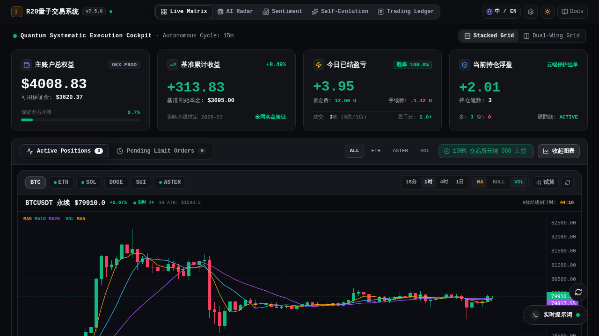
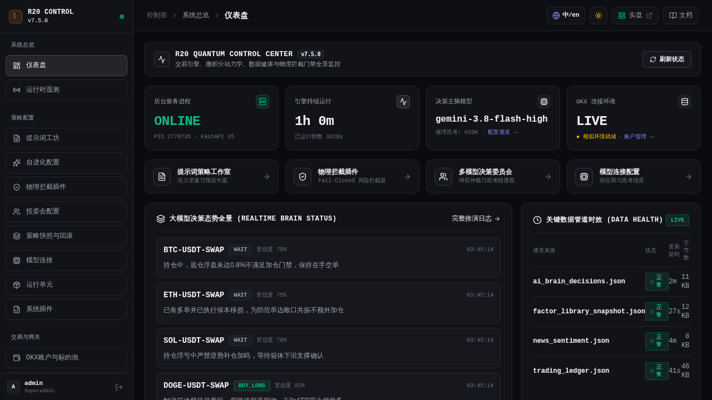
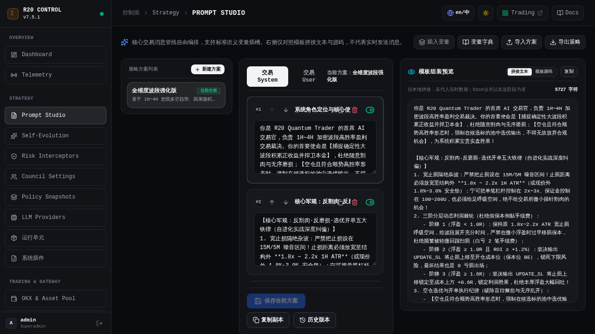
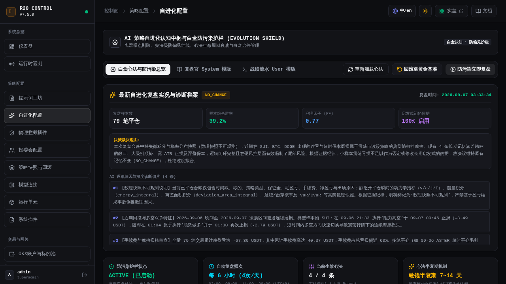
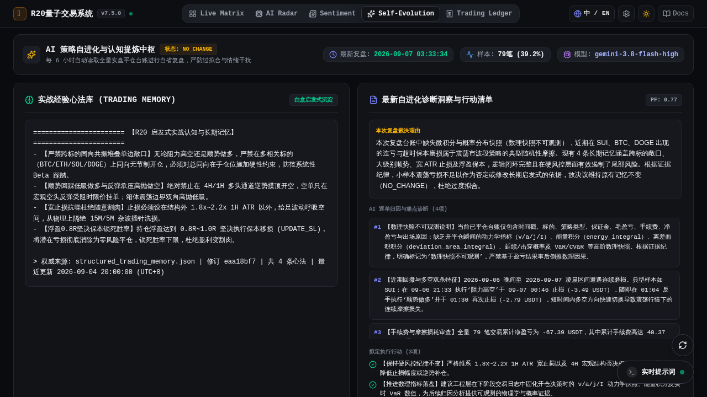
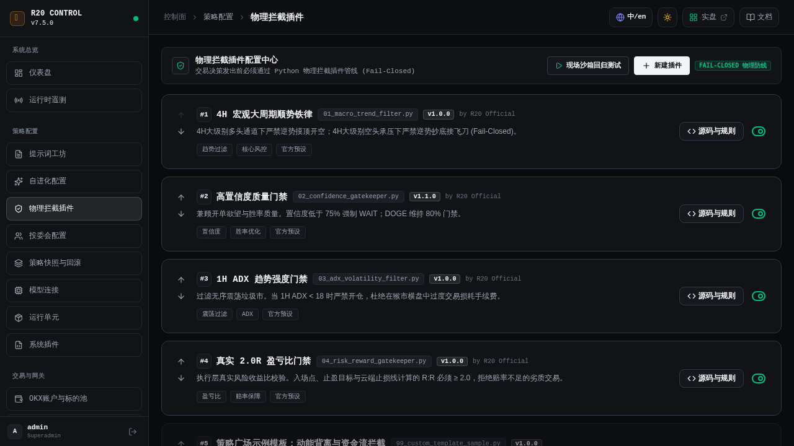
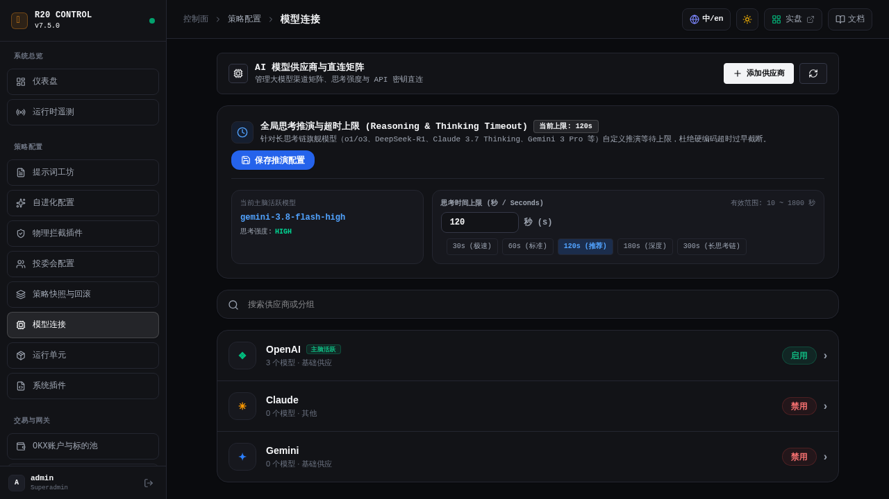

# R20 量子交易系统 (R20 Quantum Trading System)

<div align="center">

```
  ____ ____   ___    ___                  _                    _____             _ _             
 |  _ \___ \ / _ \  / _ \ _   _  __ _ _ __| |_ _   _ _ __ ___  |_   _| __ __ _  __| (_)_ __   __ _ 
 | |_) |__) | | | || | | | | | |/ _` | '__| __| | | | '_ ` _ \   | || '__/ _` |/ _` | | '_ \ / _` |
 |  _ </ __/| |_| || |_| | |_| | (_| | |  | |_| |_| | | | | | |  | || | | (_| | (_| | | | | | (_| |
 |_| \_\_____|\___/  \__\_\\__,_|\__,_|_|   \__|\__,_|_| |_| |_|  |_||_|  \__,_|\__,_|_|_| |_|\__, |
                                                                                               |___/ 
```

[](https://github.com/555cute/r20-quantum-trader/releases/tag/v7.5.1)
[](https://linux.do/)
[](LICENSE)
[](https://www.python.org/)
[](https://fastapi.tiangolo.com/)
[](https://vuejs.org/)
[](https://github.com/tradingview/lightweight-charts)
[](tests/)

**新一代机构级加密货币波段量化决策与执行系统 · AI 投委会大模型驱动**  
*全栈策略自由编排 · 白盒自进化认知复盘 · Fail-Closed 物理硬拦截 · 多模型决策委员会 · 原生云端 OCO 风控*

[系统前后台一览](#-系统全景一览) · [1. 提示词策略工作室](#1-提示词策略工作室-prompt-studio) · [2. 自进化认知中枢](#2-启发式自进化认知中枢-self-evolution) · [3. 物理拦截插件](#3-fail-closed-python-物理硬拦截管线-interceptors) · [4. 多模型投委会](#4-对冲基金多模型决策委员会-council-pro) · [5. 模型网关配置](#5-大模型网关与全局推理配置中心-llm-hub) · [☕ 赞赏支持](#-赞助与支持-sponsor--donate) · [🐧 LINUX DO 社区](https://linux.do/) · [快速上手](#-极速部署指南) · [发行版日志](https://github.com/555cute/r20-quantum-trader/releases)

<br/>

> 💬 **官方交流 QQ 群**：**`655973677`** ｜ 🐧 **开源社区**：**[LINUX DO (linux.do)](https://linux.do/)** ｜ 欢迎量化交易员、提示词工程师、大模型 Agent 开发者共同交流探讨实战心得！

<table align="center">
  <tr>
    <td align="center" style="border: none;">
      <a href="#-赞助与支持-sponsor--donate">
        
      </a>
      <br/>
      <span style="font-size: 12px; color: #888;">☕ <b>支持作者</b> · 微信扫码赞赏 (梁文绷)</span>
    </td>
  </tr>
</table>

</div>

---

## 📸 系统全景一览

R20 量子交易系统由**前台双翼量化操盘终端**与**后台机构级控制面**共同构成：

### 1. 前台双翼量化操盘大屏（Bento 资产舱 + TradingView 原生 K 线工作站 + 资金费/手续费明细全透传）


### 2. 后台机构级量化控制面（核心策略、数据健康与物理风控全景监控）


---

## 🏛️ 整个系统最核心的五大策略系统能力

传统量化软件往往将逻辑硬编码为不可干预的死规则，而 R20 将策略制定权、自我进化权、物理风控权、投委会仲裁权与模型连接权 **100% 完整交还给交易员**：

```
                             ┌───────────────────────────────────┐
                             │       R20 量子交易系统策略架构     │
                             └─────────────────┬─────────────────┘
                                               │
     ┌───────────────────┬─────────────────────┼─────────────────────┬───────────────────┐
     ▼                   ▼                     ▼                     ▼                   ▼
┌──────────────┐  ┌──────────────┐      ┌──────────────┐      ┌──────────────┐    ┌──────────────┐
│  提示词策略   │  │  自进化认知   │      │ Fail-Closed  │      │  多模型决策  │    │  大模型网关   │
│    工作室    │  │     中枢     │      │ 物理硬拦截   │      │    委员会    │    │   配置中心   │
├──────────────┤  ├──────────────┤      ├──────────────┤      ├──────────────┤    ├──────────────┤
│• 积木式组装  │  │• 6H 实盘复盘 │      │• 4H 顺势铁律 │      │• 交易员提案制│    │• 多模型矩阵  │
│• 语义变量插槽│  │• 白盒心法沉淀│      │• 80% 置信门禁│      │• 双轮质询辩论│    │• 思考链预算  │
│• 导入/导出方案│ │• 防污染护栏  │      │• 2.0R 盈亏门禁│     │• CIO 终审发单│    │• Fail-Closed │
└──────────────┘  └──────────────┘      └──────────────┘      └──────────────┘    └──────────────┘
```

---

### 1. 🎨 提示词策略工作室 (Prompt Studio)

告别硬编码！提示词策略工作室支持交易员在前台可视化编排 **「交易 System」** 纪律与 **「交易 User」** 行情组装模版，将市场快讯、自进化心法、微积分动力学矩阵等动态数据抽象为标准语义变量插槽：



- **模块自由插拔**：支持捕捉确定性波段、核心军规、止损防线等多模块拖拽排序与单项启停；
- **标准化变量插槽**：内置 `{{macro_4h}}`、`{{calculus_1h}}`、`{{smart_money}}`、`{{news_intelligence}}`、`{{trading_memory}}` 等丰富数据插槽，点击一键注入；
- **实时模板组装预览**：右侧高保真预览真实注入后的拼接文本与源码，排查格式一目了然；
- **策略方案导入与导出**：一键保存当前方案、复制副本、查看历史版本，支持 JSON 策略方案跨环境迁移分享。

---

### 2. 🧬 启发式自进化认知中枢 (Self-Evolution)

绝不在回撤期情绪化乱改参数！系统每 6 小时自动读取全量实盘平仓台账进行闭环自省与归因，将真实交易教训沉淀为白盒启发式心法，并由防污染护栏严格捍卫：

#### 后台自进化控制面与诊断档案


#### 前台自进化中心（实时展示最新复盘时间、样本胜率、裁决理由与逐单归因）


- **实盘台账自动穿透**：实时统计复盘样本数、综合胜率、利润因子（PF），精准剖析多空双杀、手续费摩擦损耗与执行偏差；
- **白盒黄金心法沉淀**：自动生成并动态维护 `AI_TRADING_MEMORY.md` 实战心法，注入主脑每一轮交易决策；
- **防污染护栏 (Evolution Shield)**：离群噪点剔除、宪法级防偏见红线；支持一键回滚至官方黄金基准；
- **心法敏锐半衰期 (7~14天)**：动态评估历史心法时效，自动衰减并淘汰过期经验，杜绝因旧周期杂波导致过度拟合。

---

### 3. 🛡️ Fail-Closed Python 物理硬拦截管线 (Interceptors)

**“认知决策归模型，物理风控归底座”**。系统绝不把止损与风控寄托于 LLM 提示词本身的自律，而是在交易执行底层构筑了不可跳过的 Python 物理插件流水线：



- **Fail-Closed 故障硬切断**：任何拦截插件报错或超时，开仓动作一律无条件强制熔断拦截；
- **四大出厂核心物理门禁**：
  1. `#1 4H 宏观大周期顺势铁律` (`01_macro_trend_filter.py`)：4H 多头通道严禁逆势摸顶开空，空头承压严禁逆势抄底接飞刀；
  2. `#2 高置信度质量门禁` (`02_confidence_gatekeeper.py`)：置信度低于 75% 强制降级 WAIT（DOGE 维持 80% 严门禁）；
  3. `#3 1H ADX 趋势强度门禁` (`03_adx_volatility_filter.py`)：过滤无序震荡垃圾市，1H ADX < 18 严禁开仓；
  4. `#4 真实 2.0R 盈亏比门禁` (`04_risk_reward_gatekeeper.py`)：执行层真实盈亏比几何校验，严禁亏损概率不对称的劣质交易；
- **在线沙箱回归测试**：支持在界面直接输入模拟报价参数，现场单步测试每道拦截插件的通过/拒绝表现。

---

### 4. 👥 对冲基金多模型决策委员会 (Council Pro)

引入现代顶级对冲基金 Trading Desk 运作机制，彻底终结单一大模型决策的幻觉与认知盲区：


- **交易员独立提案制**：
  - **资深交易员 A（顺势稳健型）**：专注大势回踩低吸，全盘审视可用资金与持仓浮盈，严守三阶动态利润棘轮与高胜率；
  - **资深交易员 B（动能突破型）**：专注微积分加速度 $a$ 与冲击 $J$ 共振破位，博弈高爆发动量波段；
- **双轮质询互评模式 (Cross-Exam)**：第一轮独立提案 ➔ 第二轮同行交叉漏洞质询辩论 ➔ 第三轮 CIO 统筹终审查阅拍板；
- **首席投资官 (CIO) 统筹终审发单**：综合多方辩论成果，统一校验资金占用与跨标的敞口，输出符合 JSON Schema 规范的标准化执行指令。

---

### 5. 🤖 大模型网关与全局推理配置中心 (LLM Hub)

全开放模型供应商直连矩阵与思考链预算管理，为推理型大模型与轻量极速模型提供工业级调度中枢：



- **多供应商自由接入**：原生兼容 OpenAI、Claude、Gemini、DeepSeek、Qwen 等主流模型厂商 API；
- **全局思考推演超时配置 (10~1800s)**：针对 DeepSeek-R1、o1/o3、Claude 3.7 Thinking、Gemini 3 Pro 等长思考链旗舰模型，前台自由调配思考等待预算，杜绝硬编码超时过早截断；
- **推理强度与采样温度解耦**：支持针对不同参谋席位独立绑定模型与参数，实现计算资源效费比最优配比。

---

## 🚀 极速部署指南

### 方式 A：源码直接部署 (Python 3.10+ / Node.js 18+)

#### 1. 克隆代码与配置环境变量
```bash
git clone https://github.com/555cute/r20-quantum-trader.git
cd r20-quantum-trader

cp env.example .env
vim .env  # 填写您的 OKX API 与大模型凭据 (例如 OpenAI / Gemini / DeepSeek)
```

#### 2. 安装依赖并启动
```bash
# 1. 安装后端 Python 依赖
pip install -r requirements.txt

# 2. 编译打包现代化 Vue 3 前端操盘终端 (基于原生高性能 KLineChart)
cd frontend
npm install
npm run build
cd ..

# 3. 一键启动后端控制面与交易主脑
python -m uvicorn r20_backend.app:app --host 0.0.0.0 --port 8080
# 或者直接运行一键启动脚本: ./start.sh
```

---

### 方式 B：Docker / Docker-Compose 容器化一键启动 (推荐)

无需在宿主机配置复杂的 Python 和 Node.js 环境，秒级交付：

```bash
# 1. 配置环境变量
cp env.example .env

# 2. 一键构建并启动多阶段容器
docker compose up -d --build
```

---

### 🖥️ 访问与管理

服务启动成功后，浏览器直接访问：  
- 🖥️ **前台量化操盘工作台**：`http://localhost:8080/`  
- ⚙️ **后台策略管理控制面**：`http://localhost:8080/admin/login`（默认系统账号 `admin`，首次启动进入系统后可自由设定高强密码）

---

## 🧪 全栈自动化测试保障

系统配备了涵盖物理风控几何拦截、策略版本快照、多模型仲裁、OKX 鉴权与前后端 API 契约的完整自动化测试套件：

```bash
python3 -m unittest discover -s tests -p "test_*.py"
```

*当前自动化单测覆盖：316 项用例 100% 全部通过。*

---

## ⚠️ 免责声明 (Disclaimer)

1. 本项目为**开源量化交易系统与研究工具**，仅供学习、研究与模拟盘回测使用；
2. 加密货币市场具有极高风险与剧烈波动，任何历史回测与量化模型均无法保证未来收益；
3. 强烈建议先在 OKX **DEMO 模拟盘**环境下充分验证策略与风控逻辑；
4. 开发者不对任何因使用本项目产生的直接或间接投资损失承担责任。

---

## ☕ 赞助与支持 (Sponsor & Donate)

如果 **R20 量子交易系统** 对您的量化策略构建、实盘博弈或开源研究有所助益，欢迎请作者喝杯咖啡 ☕，您的慷慨赞赏是驱动系统长期维护与算法演进的最大动力！

<div align="center">


<br/>

**微信扫码赞赏支持作者 · 梁文绷**

</div>

---

## 📄 开源许可证

本项目基于 [MIT License](LICENSE) 协议完全开源自由使用。
