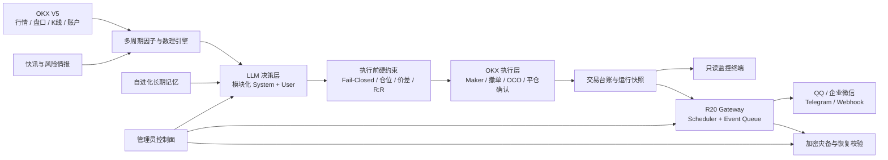

<div align="center">

# R20 Quantum Trader

### 面向 OKX 永续合约的 LLM 原生量化交易系统

**独立 Gateway · 多因子推演 · 交易执行 · 只读监控 · 管理控制面 · 多通道通知 · 加密灾备**

[](https://github.com/555cute/r20-quantum-trader/releases/tag/v6.0.0-preview)
[](https://www.python.org/)
[](https://www.okx.com/)
[](#验证与测试)
[](LICENSE)

[在线只读终端](https://www.r20.cn/) · [v6.0.0 Preview](https://github.com/555cute/r20-quantum-trader/releases/tag/v6.0.0-preview) · [独立部署](STANDALONE.md) · [恢复指南](RECOVERY_GUIDE.md)

</div>

---


> [!WARNING]
> R20 是研究型自动化交易项目，不构成投资建议，也不承诺收益。建议先使用 OKX **DEMO 模拟盘**完成配置、通知、止盈止损与故障恢复验证，再评估是否连接真实资金。

## v6.0.0 Preview 是什么

R20 把行情、数理因子、LLM 裁决、交易执行、通知、调度和灾备收敛到一套可审计的本地运行时中。公开 Web 端始终保持**只读监控**；所有敏感配置和受保护操作都放在独立管理员控制面中。

v6.0.0 Preview 的重点不是增加更多按钮，而是让关键链路更可控：

- **R20 原生 Gateway**：事件队列、通知投递、定时任务与 Worker 生命周期不再依赖外部 Agent 调度。
- **OKX LIVE / DEMO 隔离**：两套凭证独立保存；模拟盘请求自动携带 `x-simulated-trading: 1`。
- **模块化提示词管线**：交易 System、交易 User、自进化 System、自进化 User 分别由有序模块编译；P0、JSON 契约和实时数据模块受保护。
- **插件化灾备**：本地、S3、OSS、WebDAV/OpenList 与百度网盘官方 OAuth 等目标统一进入备份任务模型。
- **可靠通知通道**：QQ 官方 Bot、企业微信、Telegram 与通用 Webhook，可独立诊断、测试和启停。
- **Fail-Closed 执行边界**：持仓查询异常、流动性价差超限或必要保护缺失时，中止交易循环，而不是带病执行。

## 产品界面

### 实盘矩阵

官方账户权益、净收益、持仓浮盈、在途订单、云端保护和权益走势集中在一张高密度只读终端中。公开页面不提供开仓、平仓或修改配置入口。


### AI 全维因子矩阵

每个标的同时展示价格与盘口、ADX / RSI / CMF、微积分速度与加速度、定积分做功、条件延续概率、VaR，以及 Top100 聪明钱资金结构。


### 生命周期交易台账

统一记录方向、杠杆、策略形态、保证金、开平仓时间、净盈亏、持仓耗时和离场原因，支持在途与已平仓过滤。


### 独立管理员控制面

管理员页面采用账号密码与 PBKDF2-SHA256 会话认证，集中管理 Gateway、Agent、提示词、通知、灾备、OKX 环境和审计日志。敏感值仅显示配置状态，不回显原文。


## 核心能力

| 能力 | 当前实现 |
| --- | --- |
| 市场范围 | 默认 BTC、ETH、SOL、DOGE、SUI、LINK；后台共享币种池最多 6 个 |
| 时间框架 | 4H 宏观结构、1H 趋势与动力学、15M 执行辅助 |
| 数理引擎 | 速度、加速度、Jerk、定积分做功、VWAP 偏离面积、条件概率、VaR / CVaR |
| LLM 裁决 | OpenAI-compatible 接口；支持模型与 reasoning effort 配置 |
| 交易执行 | OKX V5、Maker 限价单、冲突订单清理、云端止盈止损、DEMO / LIVE 隔离 |
| 风险门禁 | 最大持仓数、单笔权益占比、单币种加仓次数、累计保证金、价差与查询 Fail-Closed |
| 自进化 | 根据真实交易结果生成带时间戳的长期策略记忆，并注入后续推演 |
| 通知 | QQ 官方 App Bot、企业微信、Telegram、通用 Webhook |
| 灾备 | 多任务、多目标、scrypt + AES-256-GCM、清单校验与只读恢复演练 |
| 运维 | FastAPI 控制面、Gateway Worker、SQLite 持久队列、审计日志、systemd 示例 |

## 系统架构



### 进程边界

```text
r20_backend.app       FastAPI 控制面 + 只读监控 API + 管理员认证
r20_gateway.worker    唯一调度所有者 + 持久事件投递 Worker
scripts/*             因子、AI 主脑、执行、自进化、台账和灾备任务
SQLite / data/*       Gateway 队列、管理员、快照与本地加密配置
```

> 不要同时运行旧 QwenPaw Cron、`r20_backend.scheduler` 和 `r20_gateway.worker`。v6 的调度所有者是 `r20_gateway.worker`。

## 快速开始

### 1. 克隆并安装

```bash
git clone https://github.com/555cute/r20-quantum-trader.git
cd r20-quantum-trader

python3 -m venv .venv
source .venv/bin/activate
pip install -r requirements.txt
```

### 2. 创建本地配置

```bash
cp env.example .env
chmod 600 .env
```

最小启动配置：

```dotenv
LLM_BASE_URL=https://api.openai.com/v1
LLM_API_KEY=replace_me
LLM_MODEL=your_model
LLM_REASONING_EFFORT=high

# 安全默认值：模拟盘
R20_OKX_ENV=demo
OKX_DEMO_API_KEY=
OKX_DEMO_SECRET_KEY=
OKX_DEMO_PASSPHRASE=

R20_SETUP_TOKEN=replace_with_a_long_random_setup_token
R20_MANUAL_CLOSE_ENABLED=0
```

首次部署推荐只配置 LLM 与 OKX DEMO。通知、提示词方案、灾备位置和管理员账号可在 `/admin` 中继续完成。

### 3. 构建 Vue 前端

```bash
cd r20_frontend
npm install
npm run build
cd ..
```

开发模式可运行 `npm run dev`，Vite 会将 `/api` 请求代理到本地 FastAPI。正式运行时无需 Node.js 常驻，FastAPI 会直接托管 `r20_frontend/dist`。

### 4. 启动控制面

```bash
source .venv/bin/activate
python3 -m uvicorn r20_backend.app:app --host 0.0.0.0 --port 8080
```

访问：

- 只读终端：`http://127.0.0.1:8080/`
- 管理后台：`http://127.0.0.1:8080/admin`
- 健康检查：`http://127.0.0.1:8080/api/v1/health`

### 5. Gateway 运行模式

默认配置 `R20_GATEWAY_MODE=embedded`：启动 FastAPI 后端时会自动监督并启动唯一的 `r20_gateway.worker`，**本地开发无需再开第二个终端**。

只有 systemd 等需要独立进程管理的环境才使用：

```dotenv
R20_GATEWAY_MODE=external
```

随后分别启动：

```bash
python3 -m uvicorn r20_backend.app:app --host 0.0.0.0 --port 8080
python3 -m r20_gateway.worker
```

生产环境可使用：

- [`deploy/r20-quantum.service`](deploy/r20-quantum.service)（已固定为 external）
- [`deploy/r20-gateway.service`](deploy/r20-gateway.service)

不要同时启动 embedded Gateway、独立 Gateway、旧 QwenPaw Cron 或 `r20_backend.scheduler`，否则会产生重复调度竞争。完整迁移与 systemd 操作见 [`STANDALONE.md`](STANDALONE.md)。

## Docker Compose 部署

项目提供多阶段 [`Dockerfile`](Dockerfile) 和 [`compose.yaml`](compose.yaml)：Node 构建阶段编译 Vue 前端，最终镜像只保留 Python/FastAPI 运行环境。容器内使用 embedded Gateway，因此只需要一个应用服务。

### 1. 准备持久化配置

Linux / macOS：

```bash
mkdir -p docker/config
cp env.example docker/config/.env
chmod 600 docker/config/.env
```

Windows PowerShell：

```powershell
New-Item -ItemType Directory -Force docker/config
Copy-Item env.example docker/config/.env
```

至少检查以下配置：

```dotenv
R20_OKX_ENV=demo
R20_SETUP_TOKEN=replace_with_a_long_random_setup_token
R20_MANUAL_CLOSE_ENABLED=0
```

若 `R20_SETUP_TOKEN` 仍为空或为模板值，容器首次启动时会自动生成随机 Token。查看生成结果：

```bash
docker compose exec r20 sh -lc "grep '^R20_SETUP_TOKEN=' /app/config/.env"
```

### 2. 构建并启动

```bash
docker compose up -d --build
```

自定义宿主机端口：

```bash
R20_HTTP_PORT=18080 docker compose up -d --build
```

PowerShell：

```powershell
$env:R20_HTTP_PORT = "18080"
docker compose up -d --build
```

默认访问地址：

- 交易终端：`http://127.0.0.1:8080/terminal/trading`
- 管理后台：`http://127.0.0.1:8080/admin`
- 健康检查：`http://127.0.0.1:8080/api/v1/health`

### 3. 查看状态与日志

```bash
docker compose ps
docker compose logs -f r20
docker compose exec r20 python scripts/verify_frontend_contracts.py
```

### 4. 持久化目录

| 容器目录 | Compose 存储 | 内容 |
|---|---|---|
| `/app/config` | `./docker/config` | 可由管理后台原子更新的 `.env` |
| `/app/data` | `r20_data` | 管理员、Gateway、台账与策略数据库 |
| `/app/logs` | `r20_logs` | 后端、Gateway 与交易日志 |
| `/app/backups` | `r20_backups` | 本地灾备归档 |

备份命名卷：

```bash
docker run --rm -v r20-quantum-trader_r20_data:/data -v "$PWD":/backup alpine tar czf /backup/r20-data.tar.gz -C /data .
```

### 5. 更新镜像

Docker 部署不会在容器内部执行 `git pull`。更新代码后，在宿主机执行：

```bash
git pull --ff-only
docker compose build --pull
docker compose up -d
```

停止服务但保留数据：

```bash
docker compose down
```

删除服务和全部命名卷（会永久删除本地数据库与日志）：

```bash
docker compose down -v
```

## 前后端接口契约检查

Vue 前端实际使用的 API、FastAPI 路由、管理配置字段和 SPA 深链接可以通过以下命令统一检查：

```bash
python scripts/verify_frontend_contracts.py
```

检查范围包括：

- `/api/all` 终端聚合数据；
- 管理员登录、退出和 Session；
- 总览、Gateway、Agent、插件、配置、审计、标的、通知、灾备和更新状态；
- `PUT /api/v1/admin/config` 请求字段；
- `/terminal/*`、`/admin` 和 Vue 构建产物。

## 配置原则

### OKX 环境

- 默认使用 `R20_OKX_ENV=demo`。
- LIVE 与 DEMO API Key 必须分别创建和保存。
- Web 监控、策略执行、台账同步和管理员快速平仓共享同一环境选择器。
- 手动快速平仓默认关闭；开启后仍需管理员密码、一次性 Token 和精确确认短语。

### 提示词

提示词库直接编辑四条实际消息管线：

1. 交易 System
2. 交易 User
3. 自进化 System
4. 自进化 User

系统会锁定或 Fail-Closed 保护 P0、输出 JSON 契约与执行层硬约束。运行时模块匹配失败时，实时行情输入不能被静默丢弃。

### 通知

各通道独立启用、独立诊断、独立测试。测试发送需要明确确认短语；“仅诊断”不会外发消息。

个人微信通知不属于 R20 的可用通道。请使用 QQ、Telegram、企业微信或 Webhook，并至少启用两个彼此独立的通道承接关键告警。

### 灾备

简化模式只需要选择备份内容、保存位置、执行时间和保留份数；高级模式支持多目标、排除规则、加密、清单验证和恢复演练。密钥只保存到本地 Secret Store，不应进入 Git。

## 风险控制与安全边界

- 公开监控页面仅提供 GET 型只读能力，不放置交易按钮。
- 私有账本、`.okx/`、Token、API Key、反向代理地址和本地数据库均由 `.gitignore` 隔离。
- Secret Store 使用本机加密密钥；后台不回显完整敏感值。
- 持仓读取异常或流动性价差大于策略阈值时立即终止交易循环。
- 平仓流程要求撤销冲突委托、提交 reduce-only / close 请求并核验真实撮合结果。
- 开仓后应保持交易所云端止盈止损覆盖；本地服务离线不能成为裸仓理由。
- 所有时间调度与日报统计统一使用北京时间 `Asia/Shanghai`。

## 验证与测试

v6.0.0 Preview 发布候选已通过：

```bash
python3 -m compileall -q r20_backend r20_gateway scripts
python3 -m unittest discover -s tests -v
```

当前结果：**90 / 90 tests passed**。

测试覆盖管理员认证、提示词模块保护、Gateway 调度与持久队列、插件注册、灾备、OKX 控制面、通知通道业务码和数理因子等关键路径。真实交易、真实通知和灾备目标仍必须在部署者自己的 DEMO 环境中逐项验收。

## 项目结构

```text
r20-quantum-trader/
├── r20_backend/          # FastAPI、管理员认证、控制面、通知与 OKX 服务
├── r20_gateway/          # Scheduler、事件队列、Worker、插件与遥测
├── scripts/              # AI、因子、交易执行、自进化、同步与灾备任务
├── dashboard/            # 机构级只读 Web 终端
├── data/                 # 本地运行数据；敏感文件默认不提交
├── deploy/               # systemd 服务示例
├── docs/images/          # README 与发布截图
├── tests/                # 自动化测试
├── env.example           # 无密钥配置模板
├── STANDALONE.md         # 独立部署说明
└── RECOVERY_GUIDE.md     # 灾备与恢复指南
```

## 版本与路线

当前公开版本：[`v6.0.0-preview`](https://github.com/555cute/r20-quantum-trader/releases/tag/v6.0.0-preview)

Preview 阶段重点验证：

- Gateway 在移除外部 Cron 后的长期调度稳定性；
- OKX DEMO / LIVE 切换和交易操作的 Fail-Closed 行为；
- 多通知通道在真实网络环境中的受理与最终到达差异；
- 多目标灾备、归档校验和只读恢复演练；
- 桌面端与移动端管理员控制面的可用性。

## 社区

- QQ 交流群：`655973677`
- 作者 QQ：`1090188816`
- LINUX DO：[linux.do](https://linux.do/)
- 问题与建议：[GitHub Issues](https://github.com/555cute/r20-quantum-trader/issues)

## License

[MIT License](LICENSE)

---

<div align="center">

**R20 Quantum Trader · Build observable systems before trusting autonomous systems.**

</div>
