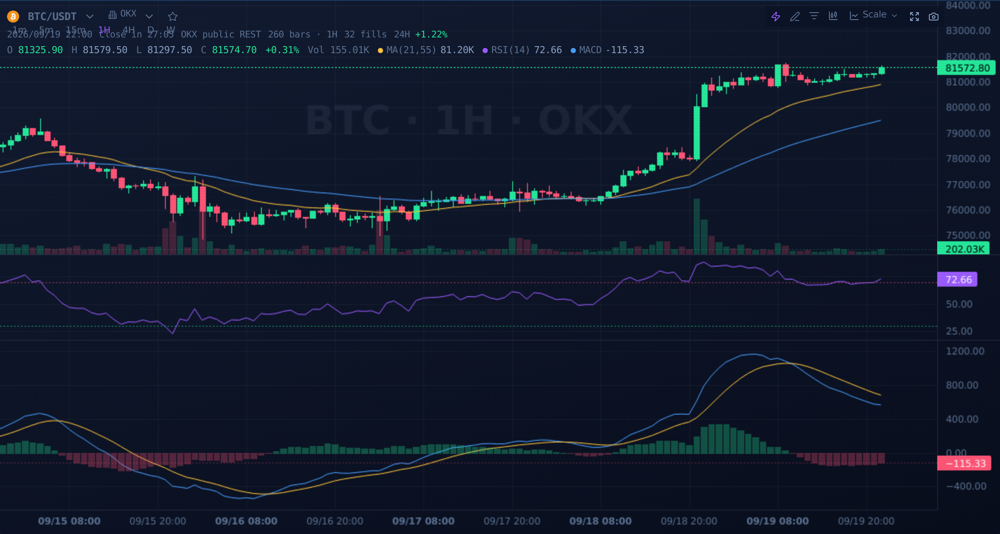
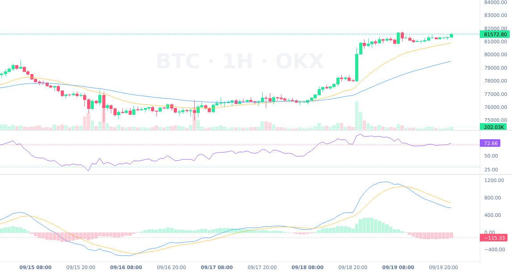
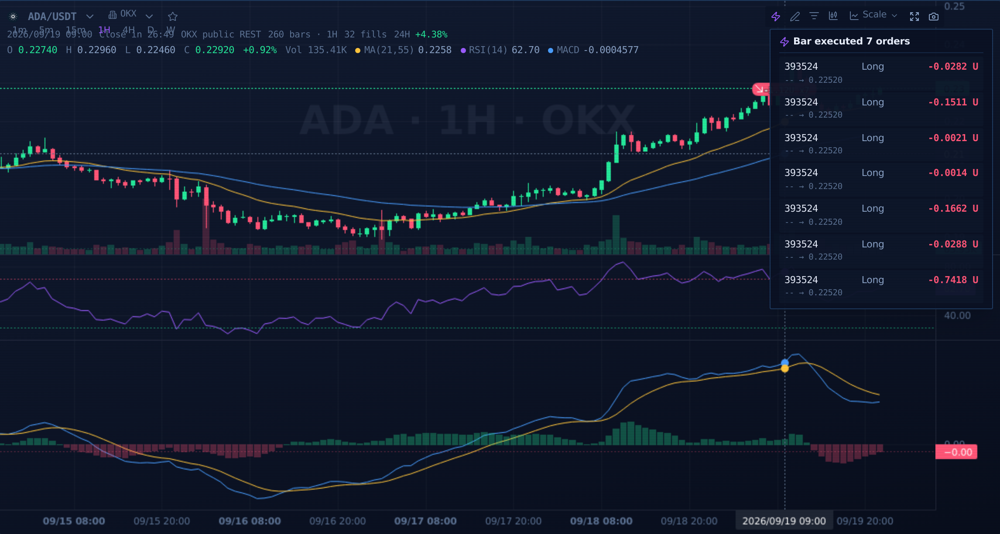
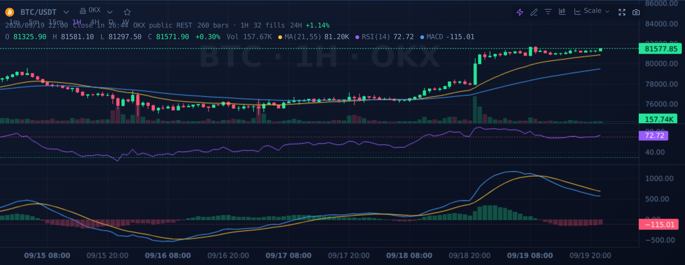
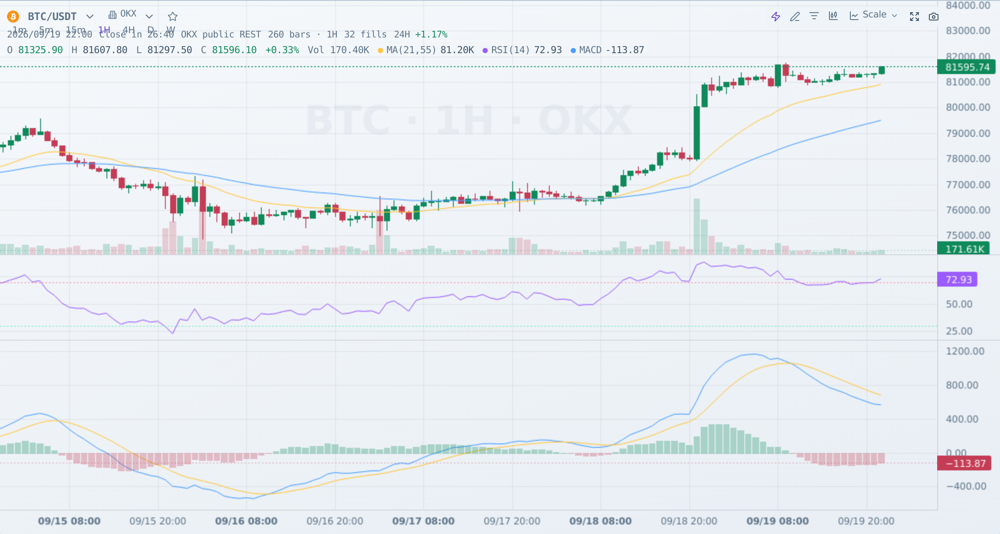
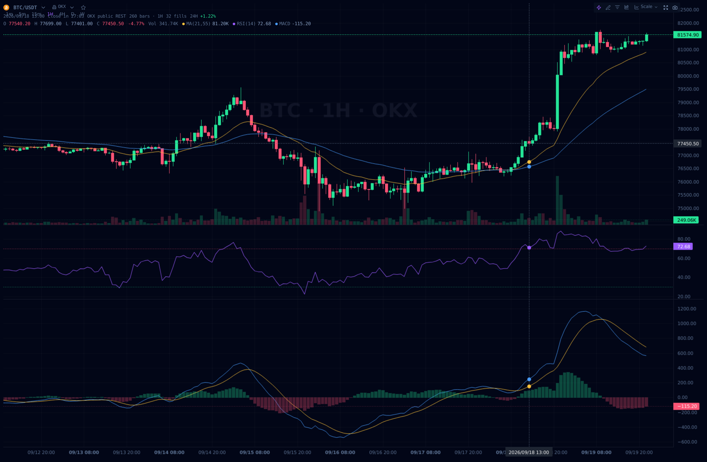

# Agent Team 修复记录（2026-09-19）

> 本轮由「参考站对齐 + 交易所官方文档核对 + TradeRank / RD-Agent 对照 + 模拟盘/实盘审计」
> 五条并行侦察线驱动。只记录**已落地**的改动与**明确未落地**的边界，不写口号。
> 与既有纪律一致：文档数字一律以 `logs/verify/runs.jsonl` 实跑记录为准。

## 一、K 线图与参考站对齐（trade.ldjx7.dpdns.org）

| 项 | 改动 |
|---|---|
| ⚡ 轨迹线 | 开平仓对连**虚线**（`[4,3]`，盈亏绿/红），55% 处方向箭头、端点圆标、悬浮高亮卡片（`#Tnn ±X.XXXX U`）；实现从 native LineSeries 换成 Canvas 叠加（当时的 `QxChart.tsx`；**2026-09 已进一步改为库原生图元 `ISeriesPrimitive`，见第二十节**） |
| 🎯 币安标 | 与 💰/👁 组成**互斥单选** `markerMode: minimal|pnl|none`；B/S 徽标按「开多最低价、开空最高价、平多最高价、平空最低价」锚定，同 K 线多笔合并 `xN` |
| 💰 盈亏气泡 | 开仓「多/空 $price」、平仓「±X.XXU」；颜色/箭头方向与参考站逐条一致 |
| 👁️ 纯净K线 | `markerMode='none'`，只保留 K 线与指标 |
| 多/空仓成本线 | 参考站同款：有持仓才画，**多仓优先、只画一条**（旧实现双线叠加） |
| 配色 | 默认配色用币安固定色 `#0ECB81/#F6465D`（与参考站逐字一致）；一旦开启色觉障得或“红涨绿跌”，自动回落应用的无障碍配色（不拿可读性换像素级相似） |
| 初始视窗 | 参考站同款「最后约 75 根 + 右侧 6 根留白」；且只在 `instId|bar|venue` 变化时设置——轮询刷新**不再重置**用户的缩放/平移（旧实现每次 fetch 都 `fitContent()`） |
| 左上 HUD | 参考站同款 OHLCV 悬浮层（O/H/L/C/涨跌%/Vol）；不属于成交叠加层，👁️ 纯净K线不隐藏它 |
| 工具栏样式 | ⚡ 轨迹线带脉冲状态点；标记模式为分段按钮组（容器底色 + 激活加粗），与参考站同构 |
| 十字线悬浮卡 | 参考站同款：单笔标题 `#Tnn 止盈平仓/止损出场/开仓入场`，多笔标题 `⚡ 本K线执行 N 笔委托`；每行给出方向、开→平价格、数量、持仓时长 |
| 数据契约 | 前端新增 `shortPairId()`（台账 id → `#Tnn`），成交行增加 `qty`（`size`）；复用现有台账数据，不新增数据源 |

## 二、智能对冲网格对齐（参考站看板）

- 后端 `paper_grid.rs` 新增参考站同形字段：`current_price / initial_capital / total_equity /
  total_realized_pnl / unrealized_pnl / net_profit / roi_pct / win_rate / total_closed_trades /
  max_drawdown / start_time / symbol / equity_curve([{time,value}]) / trade_pairs(pair_id、side_label、
  hold_seconds、roi_pct、fee、trailing、status) / positions.{long,short}.{avg_price,holding,status,desc}`。
  全部由**同一份模拟账本**推导，不新增第二套口径。
- 后端新增 `grid::RegimeSnapshot::sentinel_view()`：`{adx, atr, direction, stage, stage_label}`；
  core 的 15s 网格循环每轮推入 `paper_grid.set_regime()`，与网格触发**同源同帧**。
- 前端新增「环境量化雷达」（ADX/ATR/阶段徽章）与「已运行」脉冲点 + 时长；配对表标题改为
  「模拟合约配对明细（paper 模拟）」——参考站是实盘大屏，本仓该面板是 paper 模拟，不能照抄「实盘」二字。
- 配对表补齐参考站列：独立的「状态」列（本仓只存已闭环配对，如实显示`已平仓`而不编造持仓中行）、
  `{实际杠杆}x回报`（参考站固定 10x，本仓按配置杠杆计算并在标签上写明）、表头右侧 `已平仓 N 笔 · 共 N 组配对`。
- **明确未对齐**：参考站不公开其布网/止盈/清仓算法（页面自述「绝不暴露未来挂单算法」），
  本仓继续使用自己已在 `paper_grid.rs` 记录的有界规则；`regime.stage` 的档位语义按本仓确定性映射，
  不假装知道参考站的私有档位定义。

## 三、交易所缺陷（对照官方文档逐条核实）

| # | 文件 | 问题 | 修复 |
|---|---|---|---|
| B1 | `exchanges/gate.rs` | 单笔撤单打到 `DELETE /futures/usdt/orders?contract&id`（官方那是 **Cancel all**），可能误撤全合约挂单 | 改为路径参数版 `DELETE /futures/usdt/orders/{order_id}` |
| B2 | `exchanges/binance.rs` | 保护腿回读打 `GET /fapi/v1/algoOrder?status=open`（官方该端点是**单笔查询**，必填 algoId），回读恒失败 → 挂保护失败回滚 | 改用 `GET /fapi/v1/openAlgoOrders`，去掉 `status` |
| B3 | `exchanges/binance.rs` | 算法单全撤用不存在的 `/fapi/v1/algoOrder/all` | 改用 `DELETE /fapi/v1/algoOpenOrders` |
| B4 | `okx/public.rs` | `taker_net_usd` 把 `[ts, sellVol, buyVol]` 写反为 sell−buy，microstructure 因子方向整体取反（**官方文档原文已核实**） | 改为 buy−sell，并新增纯函数单测钉死列序 |
| B6 | `adapter_impls.rs` | OKX `reduce_only=true` 一律映射 `posSide="net"`（单向模式写法），双向持仓必被拒 | 映射为平空=short / 平多=long，且不再发 `reduceOnly` |
| B7 | `exchanges/gate.rs` | ticker 用不存在的 `volume_24h_base`；`chg_24h_pct` 把缺失写成 0 | 改用 `volume_24h` / `change_percentage` |
| B8 | `exchanges/okx.rs` | 读不存在的 `24hPct` 字段 | 由 `last / open24h − 1` 计算 |
| B9 | `exchanges/bybit.rs` | 幂等 GET 只对 429 重试，5xx 不重试（与其它四所不一致） | 与共享策略对齐（429+5xx） |
| B10 | `exchanges/binance.rs` | New Algo Order 缺必填 `algoType` | 补 `algoType=CONDITIONAL` |

**官方文档核实后驳回的一条**：OKX `history-candles` 的 `limit` 上限是 **300**（官方原文
"The maximum is 300. The default is 100."），不是 100 —— 现有 `chunk=300` 无需修改；
已把该结论写进 `okx/public.rs::candles_history` 的注释，防止下一次审计再按“上限 100”误改。

**E2 网络抖动处理（本轮补齐）**：
- 公共行情单请求超时改为 `R20_PUBLIC_HTTP_TIMEOUT_SECS`（1-120，非法值回落场所默认）
  可调；本机部署置 8s（Gate/Binance 公共 GET 原为 4s）。
- 重试只对**瞬态**错误（`is_timeout/is_connect/is_request`）；DNS 不存在 / TLS 证书错误 /
  URL 非法不再无意义重试（旧实现对所有 `reqwest::Error` 一律重试，放大延迟与日志）。

**D3/D4 审计工具（本轮补齐）**：
- `quantx_venue_endpoint_audit.sh` 的 Binance 正则补上 `/futures/data/...` 分支；
  重跑后五所在用路径全部 PASS（Binance 全 451 按 WARN 记，非 FAIL）。
- 新增参数级单测：OKX `posSide` 四条映射（B6）、Binance 在途算法单集合端点且不带 `status`（B2）、
  `algoType=CONDITIONAL`（B10）、Gate 单笔撤单路径不等于集合端点（B1）。

**D1/D2 文档纠偏**：`docs/exchange_support_matrix.md` 的「健康感知备源排序 / OKX 全断备源」
与代码事实不符（`venue_health.json` 只有 1 个读者、0 个写者；因子主链写死 OKX），
已改为如实描述：跨所容灾实际是 `xvenue` 的四所价差证据（至少 2 所有效报价），健康感知排序属规划中。

**环境限制（不可修）**：Binance 公共行情 451 是出口地区封锁，`data-api.binance.vision` 只有现货、
没有 USDⓈ-M 备源；UNI-USDT-SWAP 不在 OKX demo 合约目录，健康面/下单闸已按不可用处理；Gate 公共请求
超时属容器出口网络问题（重试与限流口径本身正确）。

## 四、TradeRank 规则补齐

- **R13 每周期最多 1 个新仓**：`execute_decisions` 新增 `R20_MAX_NEW_POSITIONS_PER_CYCLE`（默认 1），
  只有**成功提交的新开仓**占额，ADD 不占。
- **R14 同周期平仓后不得重开**：新增共享集合 `closed_this_cycle`（周期开头清空）；
  `close_and_record`（OKX/AI/失效监控）与多所阶梯 `close_venue_position` 平仓成功时登记，
  `execute_decisions` 对命中标的（或同 base asset）一律拒绝新开/加仓。
- **R15 失效价必填**：`.env` 置 `R20_REQUIRE_INVALIDATION=1`（TradeRank 口径）；
  `.env.example` 登记该键并保留安全默认 0；验收的「默认放行」探针已显式中和部署环境，保持确定性。
- **R17 现货等价（可选）**：新增 `R20_SPOT_EQUIVALENT=1` 时 `leverage>1` 一律拦（默认 0）。
- **R11 权益比例下限（可选）**：新增 `R20_MIN_ENTRY_EQUITY_RATIO`（默认 0=关，TradeRank 为 0.10）；
  非法值（0/负/NaN/>1）按关闭处理，不会把开仓锁死。
- **R10 理由留痕**：`hold/close` 缺少 `reason` 时打 WARN（不拦，与「漏字段不升级成系统停摆」同纪律）。
- **事后证伪闭环**：`close_and_record` 写 `data/thesis_reviews.json`（最新在前，封顶 500）：
  thesis / invalidation / invalidation_px / **方向感知的 invalidation_hit** / exit_reason / source；
  自进化复盘报告新增 `thesis_review{reviewed, invalidation_declared, invalidation_hit, invalidation_hit_pct}`
  与一条 insight，供“失效驱动的离场比例”统计。
- **R18 交易数不是 alpha**：内置系统提示词新增第 6 条纪律。
- **顺手修正**：多所适配器路径此前对所有成功单都自增 `scale_in_count`，会把金字塔上限提前吃满；
  改为只对加仓自增（与 OKX 链路同一口径）。
- **未落地（已登记）**：R2 提示词深度筛选器（当前全池等深度，加筛选器有“被筛掉就不可交易”的风险）、
  R10 部分平仓、R18 Bot 榜的 BTC/SPY 基准超额（需要把基准收益从行情层注入绩效聚合，属跨层改动）。

## 五、RD-Agent 闭环（P0 + P1 + P2）

### P0 跨轮闭环（已生产验证）
- 新增 `rd_agent::RdHistory`（`tried` / `trials_total` / `sota`）与 `run_round_with_history`：
  - **SOTA 基线**：上一轮被采纳且期望最高的候选参数作为本轮基线，不再每轮回到 `StrategyParams::default()`；
  - **跨轮去重**：已试过的 `(inst, bar, knob, to)` 不再重复提交（`history_used` 记录跳过数；
    换 K 线周期 = 新实验，不被旧键挡住）；
  - **累计 trials**：DSR 的 N 改为跨轮累计（`trials_cumulative_total`），不再只数本轮。
- `rd.rs` 在**跑本轮之前**读回上一轮 `rd_latest.json`（旧实现 `prior_feedback` 是跑完后才读的死字段）。

### P1 指标与可复现性
- `CandidateMetrics` 新增 `replay_id`（继承 `BacktestReport.replay.replay_id`）、
  `buy_hold_return_pct`、`excess_return_pct`（旧报告 serde 缺省，不编造）。
- RD 报告/候选/每折 walk-forward 都带 replay_id：候选级可复现。

### P1 候选登记 + 人工晋级
- 新增 `data/rd_candidates.json` 状态机：`accepted` / `rejected` / `promoted`，含 metrics、replay_id、
  dsr/verdict、rounds、first/last_seen、promoted_at/by/reason；同 key **upsert**、promoted 不被降级。
- 新增管理端点（需管理员 / 晋级需超管，带 `rd.candidate.promote` 审计）：
  - `GET /api/v1/admin/rd/candidates`（只读登记表；匿名 401）
  - `POST /api/v1/admin/rd/candidates/promote`（**只改登记状态，不写实盘参数**；
    要求 `accepted` + **通过的多折 walk-forward** 证据，幂等）
- OpenAPI 快照已重生成（`docs/api/openapi.json`）。

### P1 滚动 walk-forward
- 新增 `rd_agent::walk_forward_validate`：把数据切 `folds+1` 段，逐折在 OOS（含 `WARMUP_BARS` 预热）
  上评估同一候选；通过条件保守：**正期望折数过半 + 中位期望 > 0 + 中位收益 > 0**。
- `R20_RD_WALK_FORWARD_FOLDS`（默认 3，0/1=关）；只对**被采纳**候选跑；
  未通过则取消采纳并写明原因——单次 holdout 的“采纳”不能脱离多折证据，这也是晋级接口的门槛。

### P2 实验 trace
- 新增 `data/rd_trace.jsonl`（只追加）：每轮摘要（weakness/trials/累计 trials/history_used/
  accepted/每个候选的 replay_id 与 walk_forward 结论），供长期人工审计。

### 已核实的运行面结果
- `rd-once`（2 标的/900 根）：登记表 2 条候选（均 rejected）、trace 逐轮追加、
  `trials_cumulative_total` 跨轮累加；晋级接口对 rejected / 不存在候选均 400 带明确原因，匿名 401。
- 单测 511 项（risk-engine + ai-gateway + core）全绿，含 walk-forward 规则、登记 upsert/promoted
  保留语义、晋级四类拒绝与幂等。
- **未落地**：`R20_RD_WALK_FORWARD_FOLDS=0` 时无法晋级（有意如此——无多折证据不晋级）；
  跨进程知识库（向量检索式经验库）仍是文档级方向，未在本轮实现。

## 六、模拟盘 / 实盘双模式

### 已落地
- **实盘凭证防误用（L1）**：`OKX_LIVE_*` 缺失时不再无条件下落到通用旧键——只要检测到任何
  `OKX_DEMO_*` 键存在，live 档就拒绝回落（fail-closed）；`okx_live_configured / okx_demo_configured` 由此可信。
- **日账本环境隔离**：`DailyState` 新增 `environment` 字段；旧文件（无环境轴）**认领当前档且不清账**
  （清零=fail-open），明确的跨档则重置为新账本——demo 的亏损不再熔断 live 新开仓（反之亦然）。
- **半热读盘收口**：`venue_execution`（选所/预算探测、未核验保护闸）、`protection`、
  `/api/health` 指标、`/api/all` 的 `executionUnverified*`、K 线默认环境、asset-panel `environment`
  全部改用 `engine::current_okx_env()`（运行期读取），不再读启动快照。
- **跨所敞口资金轴隔离**：`build_exposure_view` 只合并与当前 OKX 档**同一资金轴**
  （demo/sandbox ↔ live）的场所持仓与预留台账；另一轴的保证金不再占用本档封顶额度。
- **resting 挂单按登记环境查询**：OKX 分支用 `OkxClient::from_env(entry.environment)`，
  不再用新档凭证查旧档单号（避免条目永久滞留与单号撞车误判）。
- **HALT 运维入口**：新增 `POST /api/control/halt`（超管）→ `ExecutionCommand::Halt`，
  同步停决策循环并写回 `R20_CORE_TRADING=0`；Resume 仍需交易所对账。
- **开闸互锁（L2/L3）**：`/api/control/trading` 与 `put_config` 在 `enabled=true` 时：
  ① 当前档凭证不齐 → 409；② 实盘开闸必须带逐字短语 `OPEN LIVE TRADING`
  （body.confirmation 或 `X-R20-Confirm` 头，前端顶栏开关已在 live 档弹确认）；
  ③ `okx_environment=live` 与 `trading_enabled=true` **不得同一次保存同时成立**。
- **`okx_simulated` 遮蔽修复**：旧布尔开关翻译到 `R20_OKX_ENV` 轴（显式 `okx_environment` 优先），
  不再写一个被遮蔽的 `OKX_IS_SIMULATED`（“保存成功但没生效”）。
- **健康面补全**：`/api/health` 新增 `execution_state {mode, revision, changed_at_ms, reason}`、
  `okx_live_configured`、`okx_demo_configured`、`venue_environments[]`（场所×环境×开闸）；
  `public_status.mode` 由二态改为 `read_only_control_plane | demo_execution | live_execution` 三态。
- **前端标识**：顶栏与终端状态栏区分 `实盘执行 / 演示盘下单开`；paper 配对表标题标明 paper。
- **多所沙盒开闸**：管理面开闸同步写 `R20_GATE_DEMO_EXECUTION` / `R20_BINANCE_DEMO_EXECUTION`，
  状态接口同时返回 live/demo 两轴开闸位。

### 运行面验证（一次性实例，不影响主部署）
- 无凭证开闸 → 409「当前环境 demo 的 OKX 凭证不齐」；
- `POST /api/control/halt` → 200，健康面 `mode=Halted`（含 reason/revision），`trading_enabled=false`；
- 无凭证 Resume → 503 且**保持 Halted**（fail-closed）；
- 主部署验证后仍为 `Active` + 只读，健康 `venue_environments` 矩阵正确。

### 仍未落地（明确登记）
- **tracker / cooldown / protection 视图键的环境前缀**（`{env}:{inst}_{side}`）：波及
  manage_positions、execute_decisions、ai_position、invalidation、close_and_record、幽灵对账
  与 OKX 幽灵清理共 7 处，属一次专门重构；当前跨档混用面已由日账本/敞口/resting/半热四项收窄。
- **幽灵对账的 env 过滤**与**环境切换的持仓互锁（drain/409）**：切换接口目前只做
  「live 与开闸不得同时切」的互锁，尚未检查旧档持仓/挂单清单。
- 前端设置页切到 live 时的确认短语（顶栏开关已有）；后端已对该路径 fail-closed。

## 七、证据仲裁器（Auto-Arbiter，"胜率最高的决定自动执行"）

### 诚实前提
任何系统都无法保证“最高胜率”；且单看胜率是危险的（90% 小赢 + 10% 巨亏照样爆仓）。
可工程化的目标是：**在风险约束下，用样本外证据挑选“胜率下界与期望下界都为正”的决定，
证据不足时自动 WAIT**。本模块把这套逻辑变成可执行、可回滚、可观测的开关。

### 实现（`services/quantx-core/src/arbiter.rs`）
- **统计桶**：`(style, regime)`（如 `trend|TREND_UP` 与 `mean_reversion|RANGE` 分开）；
  style 由 `strategy::evaluate` 的 reason 归类，regime 与 `grid.rs` 同判据（ADX<18 区间）。
- **只用下界**：Wilson 胜率下界 + 期望下界（单侧 95%）；小样本自动被低估。
- **高胜率陷阱回归测试**：90% 胜率 + 负期望下界 → 必须拦。
- **三档模式**：`off`（默认，零行为）/ `advisory`（只记录与推送事件）/ `auto`（不合格拦下、合格按 1.0/0.8/0.6 分档缩放）。
- **硬不变量**：`size_scale ≤ 1.0`（只能收紧）；不合格不执行；统计**只由已平仓结算**写入。
- **接入点**：`execute_decisions` 中在既有门禁/拦截器之后、`position_size` 之前；
  `close_and_record` 结算时回灌 `(style, regime, pnl)`。
- **观测**：`GET /api/v1/admin/arbiter/stats`（各桶样本/胜率/下界/资格 + 当前配置，需管理员）；
  advisory 模式发 `arbiter` 事件，auto 栏触发 `blocked{scope=arbiter}`。
- **配置**：`R20_ARBITER_MODE` / `R20_ARBITER_MIN_LIVE_SAMPLES`（5，实盘样本硬门槛）/ `R20_ARBITER_MIN_WIN_RATE_LB`（0.5）/ `R20_ARBITER_MIN_EXPECTANCY_LB`（0）/ `R20_ARBITER_COLDSTART`（0=证据不足就 WAIT）/ `R20_ARBITER_PRIOR_WEIGHT_RD`（0.3）/ `R20_ARBITER_PRIOR_WEIGHT_PAPER`（0.2）/ `R20_ARBITER_STRATEGY_CANDIDATE`（0）。

### P3 先验（已落地）：RD/paper 只做收缩，不当实盘证据
- `collect_priors` 读取 `rd_latest.json`（候选 OOS 胜率×成交数，按 knob 归风格，挂 `style|*` 通配桶）
  与 `paper_grid_state.json`（已闭环配对盈亏，归 `mean_reversion|RANGE`），各乘权重后只参与**胜率下界**。
- **期望下界仍只认实盘样本**；`auto` 仍需实盘样本 ≥ `R20_ARBITER_MIN_LIVE_SAMPLES` —— 先验不能替代真实成交记录。
- 激活条件（诚实边界）：RD 先验要求候选回测有成交（当前实盘底线 85%/2.5R 下 1H 窗口常为 0 笔 → 无先验），
  paper 先验要求网格有已闭环配对；**没有数据就不造先验**（单测覆盖有数据时的收缩行为）。

### P4 候选对比（已落地）：LLM 风格 vs 确定性策略风格
- 同一包同一环境档下，分别用 `style_of_reason(decision.summary_reason)` 与 `style_of_packet(packet)` 计两个证据分，
  `choose()` 规则：策略不可用/不合格 → LLM；策略合格而 LLM 不合格 → 策略；都合格比排序（期望下界优先），打平 → LLM。
- **默认只记录**（`R20_ARBITER_STRATEGY_CANDIDATE=0`）：“由确定性策略代替 LLM 下单”是政策变更，必须显式开启；
  开启后策略接管仍要过全部既有门禁与证据门禁（只收紧、不放大）。
- 确定性候选报价：用当前因子包跑 `strategy::evaluate`，按 `ATR × sl_atr_mult` 铺止损、
  `risk_reward = max(min_rr, 2.0)` 铺止盈（与回测同一套几何）；缺价格/ATR/信号 → 无候选，不猜。

### 使用口径（推荐流程）
1. 先跑 `advisory`（当前部署已置）累积样本——每桶至少 `MIN_SAMPLES` 笔已平仓；
2. 看 `/api/v1/admin/arbiter/stats` 的 `win_rate_lb_pct / expectancy_lb` 与 `eligible`；
3. 证据达标后把 `R20_ARBITER_MODE=auto`——此后“证据最好的方案”自动执行，不合格自动放弃；
4. 想立即自动化可用 `R20_ARBITER_COLDSTART=1`（冷启动按 0.5x 最小仓执行）。

### 前端「三方会签」（已落地）
- 新组件 `apps/web/src/features/ConfluencePanel.tsx`，挂在 `TradingWorkstation`（/trading）网格面板下方：
  - 会签矩阵：各 `(风格×环境)` 桶的实盘/先验样本、胜率下界、期望下界、资格、仓位系数；无样本时如实空态；
  - 三栏证据：🕸️ 网格（环境阶段/ADX·ATR/剩余层数/paper 闭环胜率）、🧪 RD（候选/采纳/已晋级、最新候选、多折 WF、replay）、
    🤖 仲裁口径（模式、实盘样本门槛、胜率/期望下界门槛、先验权重、策略是否可接管）；
  - 鉴权：三个接口（arbiter/rd/grid）任一 401 → 诚实锁定态；30s 轮询 + 会话变更即刷。
- 顺带修复一个真实运行错误：图表未显式设 `localization.locale`，无头/异常浏览器 locale 下
  lightweight-charts 的 `Date.toLocaleString` 抛 `RangeError: Incorrect locale information provided`
  （实测 12 次/页，时间轴渲染失败）。已改为显式取应用语言（zh-CN/en-US）+ `dateFormat: yyyy-MM-dd`，
  并随语言切换热更新。

### 验证
- 单测 9 项（Wilson 下界、实盘样本不足放弃、冷启动、只收紧不放大、高胜率陷阱、先验收缩不替代实盘、
  候选对比四规则、分类与结算分桶、模式解析、先验汇集）。
- 聚焦测试 713 passed / 0 failed；运行面：端点 200（匿名 401）、advisory 下验收 76 PASS / 2 FAIL（仅宿主机 playwright），**行为零变更**。
- 浏览器实测（容器内 Chromium）：`/trading` 会签面板九项断言全真、**0 页面错误**；项目自带浏览器门禁 22 PASS / 0 FAIL。

### 下一步（本方案未完成部分）
- 让 RD 回测在低成交窗口也能产出先验（如按 walk-forward 折的累计样本计权，而不是单候选 trades）。

## 八、本轮同时修复的既有缺陷（前序审计发现）

- 黑天鹅门禁：时间戳不可信不再被 `!expired` 误判为「已解除」（Fail-Closed）+ 回归测试。
- `manage_positions` / `skip_llm_in_readonly` 读启动快照 → 改读本轮热重载配置；
  非法 `sl_atr_mult` 回落 2.0（不再 `continue` 跳过全部保护管理）。
- OKX 金字塔加仓计数缺失（主场所 `R20_MAX_SCALE_IN_COUNT` 形同虚设）。
- 熔断账本先于台账记账（台账写失败不再让当日熔断失明）。
- 周期结果 `halted`/`entries_blocked` 改取周期结束时的最新事实。
- 跟踪器前缀误匹配（`BTC-USDT` 命中 `BTC-USDT-SWAP_long`）。
- 前端北京时间统一入口 `apps/web/src/lib/time.ts`（旧 `toLocaleTimeString` 产物清零）。

## 九、复验入口

```bash
cargo test --release -p quantx-event-bus --lib          # 隔离复跑（本轮 37/37 通过）
cargo test --release -p quantx-ai-gateway --lib         # RD 闭环回归
scripts/quantx_acceptance.sh                            # 运行面只读自检（见 runs.jsonl）
```

> 说明：`cargo test --release --workspace` 在本机高并发下出现过与本次改动无关的
> 测试隔离 flake（span 捕获类 / CLI stub 类，轮换不同用例；隔离运行均通过），
> 已如实记录，未通过放宽断言掩盖。

---

## 九、2026-09-19 第二批（12 项问题攻坚，Agent team 并行审计 → 实施）

### 9.1 交易所数据不同步（问题 2）——根因是**字符串数值把整行丢掉**
- `crates/common/src/types.rs`：`Position` / `PendingOrder` 的数值字段此前是裸 `f64`，
  而 OKX 私有接口一律以**字符串**下发（`"pos":"0.01"`、`"lever":"10"`）。serde 直接报
  `invalid type: string, expected f64`，而读侧调用点是
  `serde_json::from_value::<Position>(row).unwrap_or_default()` / `.ok()` ——
  **错误被静默吞掉、整行被丢弃**，表现为「交易所明明有持仓/挂单，界面恒空」。
  余额之所以正常，是因为它走了另一条手工解析路径（`balance_usdt_detail` 的 `f()`）。
- 修法：新增 `okx_f64` 反序列化助手（兼容 JSON 数字 / 数字字符串 / null / 缺失 → 0），
  应用到两个结构体的全部数值字段；回归测试钉死三种形态。
- 实测：修复后 `/api/account` 的 `positions` 从 **0 → 5**（同一时间点、同一账户）。
- 附带修好：`orders-history`、保护核验、幽灵对账、跨所敞口都吃同一份持仓——
  这一处修好，四条链路同时恢复。

### 9.2 快照新鲜度（问题 2 的可观测性）
- `AccountSnapshot.snapshot_at` + `engine::{snapshot_age_ms, snapshot_is_stale}`；
  账户循环失败时保留旧快照是既有设计（宁展示旧值也不中断交易循环），但读面必须能
  判断「这份数据几秒前」。`/api/state`、`/api/account`、资产舱都返回
  `snapshot_at / snapshot_age_ms / snapshot_stale`（从未同步过 → 恒 stale，fail-closed）。

### 9.3 资产舱拉错账单端点（问题 2）
- 此前三处（台账同步 / 调试账单 / 资产舱）都打 `bills-archive`（OKX 口径：3 个月前），
  于是「近 24h 资金费/手续费」恒为空。新增 `venue_bills()` 统一入口：
  近 7 天端点优先、archive 回退，三处收口。

### 9.4 初始本金硬闸（问题 3）
- 现状：初始本金**确实**参与预算（`operating_equity = min(初始本金, 交易所权益)`），
  但缺三道闸：① 总占用保证金无上限；② 门禁 9/10 校的是 **LLM 自报** `margin_usdt`，
  不是 `position_size` 重算后的真实值（ADD 加仓路径可绕过）；③ 跨所敞口闸用
  **交易所权益**而不是操盘本金做基数。
- 修法：① `risk.rs` 门禁 10.6「Σ已占 + 本笔 ≤ 操盘本金」；② `engine.rs` 在
  `position_size` 之后用**真实 margin** 复检总占用与单标的；③ 跨所敞口基数改
  `budget.equity`；④ 读不到初始本金时打 `warn`（此前静默回落到交易所权益）。

### 9.5 标的池「加不了 / 加了不交易」（问题 4）
- 实测：大写 `AVAX-USDT-SWAP` 可加；**小写 `avax-usdt-swap` 必 400** 且报错文案
  误导（「仅支持 USDT 永续合约」，实际是后缀大小写比对失败）。
- 修法：后端 `to_uppercase()` 归一 + 文案写清「收到 XXX」；前端输入即转大写。
- **关键补漏**：注册表存在时，未被任何**启用** Bot 覆盖的标的一律被 Bot 闸断——
  此前只有「文件缺失时播种」会写 core-pool，文件一旦存在，新加的标的永远没覆盖，
  于是「加了也不交易」。新增 `bots::ensure_pool_coverage()`（只补 note 含「自动播种」
  的 Bot，不碰人工拆分的 Bot），add 响应回 `bot_coverage` 列表。
- 另修 `load_instruments()`：单条缺 `instId` 不再让**整池归零**（此前 `?` 直接把
  `Config::from_env` 变成默认 10 标，静默无报错）。
- 实测：小写 `dot-usdt-swap` → 加入成功且 `bot_coverage: ["core-pool:AVAX…","core-pool:DOT…"]`，
  `bots.json` 同步扩展（验证后已把池恢复为原 10 标）。

### 9.6 Emoji → 图标组件（问题 5）
- 图表（当时 `QxChart`，现 `components/chart/`）：⚡→`Zap`、🎯→`Target`、💰→`CircleDollarSign`、👁️→`Eye/EyeOff`（按状态切换）、
  悬浮卡 ⚡→`Zap`；`ConfluencePanel`：🕸️→`Network`、🧪→`FlaskConical`、🤖→`Bot`。

### 9.7 通知通道（问题 7）——不是"配不了"，是**自动通知只接通了一小段**
- 实测已确认渠道本身可用（4 渠道齐备、QQ 有官方 Bot 实现、本地接收器可收到 HTTP 200）。
  真缺口：`notify_evolution_report` / `notify_backup_result` / `notify_daily_summary`
  **全仓零调用**（`#[allow(dead_code)]`），调度器跑完复盘/备份不发通知；
  日报走的是 `send_test` 直发旁路，绕过队列的退避重试/死信。
- 修法：三个函数改签名 `&Path`（调度器只有 `ExecutionContext`，拿不到 `AppState`
  ——这正是它们成为死代码的原因），收口到 `evolution::run_review_notified()`
  让**定时调度与管理面「立即运行」共用同一入口**（此前我把它挂在调度器上，
  手动触发就绕过了——已修正）；备份成功/失败都通知；日报改走队列。
- QQ 群聊：`R20_QQ_GROUP_OPENID` 此前只在底层支持、管理面从不保存 → 群-only 部署
  被判「缺 OpenID」。补齐保存字段、就绪判据（单聊/群任一）、测试端点改读
  `live_secret`（此前读进程环境，刚配好也报缺）。
- 新增 `POST /api/v1/admin/notifications/enqueue-test`：走**完整入队→投递→重试**链路
  （`/test` 是直发，验证不了"排空线程有没有起来"）。
- 前端：保存/切换通道时不再丢弃后端 `warnings`（此前用户看到开关自动弹回却不知原因）。
- **端到端实测**：本地起接收器 → 配置 webhook → enqueue-test → **6 秒内排空**、
  接收器收到带北京时间的 POST。

### 9.8 功能开关搬进后台（问题 6 / 8）
- 新增 `GET/PUT /api/v1/admin/engine-flags`：**白名单** 17 项（黑天鹅门禁、失效监控、
  强制失效价、日亏口径、每周期新仓上限、现货等价、仲裁档位、策略接管、RD、
  paper 网格、心法自动退役、LLM 修复轮、调度面、RD 参数上线、两个 fail-open 逃生阀）。
- 安全：非白名单键一律 400（实测 `PATH` 被拒）；**逃生阀需逐字短语 `SET <KEY>`**
  （实测无短语 400）；全部写审计；保存写 `.env`，引擎每周期 `live_env` 读取 → 下一周期生效。
- 前端新增「引擎开关」标签页（风控组内），bool 用开关、enum 用下拉、数值用输入框，
  每项显示当前值/来源（env|default）/生效说明，未保存项高亮，逃生阀弹窗二次确认。
- 实测：改 `R20_MIN_ENTRY_EQUITY_RATIO` 后写入 `.env` 并复读成功；浏览器实测该页
  渲染 17 项 + 15 个开关控件。

### 9.9 启动自检服务（问题 9）
- 新增 `quantx-core selfcheck` 子命令 + Compose 一次性服务 `selfcheck`
  （`depends_on: core healthy`、`restart: "no"`、`--write --notify`）。
- 12 项体检：核心 HTTP / 健康总判定 / 数据层 / 行情新鲜度(90s) / 总线积压 /
  LLM 可达 / 凭证 / 调度面 / 通知通道+死信 / 状态文件新鲜度 / 磁盘(≥90% fail) /
  备份新鲜度(26h)。阈值全部复用既有口径（`api.rs::health`、`r20_watchdog.sh`），不另造一套。
- 结论落盘 `data/startup_selfcheck.json`，并在 `/api/health.startup_selfcheck` 暴露摘要
  （文件不存在 → null：区分「未自检」与「自检通过」）；另加
  `GET/POST /api/v1/admin/selfcheck`（读/立即重跑）。
- 实测（随 `compose up -d` 自动执行）：12 项中 11 ok + 1 warn（`news_feed.json` 不存在），
  退出码 0；报告可从健康面与端点两处读到。

### 9.10 「有端点无入口」的前端补漏（问题 10）
- RD 候选**晋级**按钮（此前只有后端端点，前端零入口）——对话框说明「仅改登记状态」，
  并新增可选「同时应用到实盘信号参数」。
- paper 网格**重置**按钮（端点一直存在、前端零入口）。
- 语法层面的大扫除：11 处硬编码中文收进 i18n（备份作业表单 7 处、因子抽屉 1 处、
  API 客户端错误文案 2 处按语言分支、页面 metadata 2 处），补 9 个 `qt()` 缺词
  （止损/止盈/价格/原因/盈亏/未平仓/入场），浏览器实测 `pageErrors: 0`。

### 9.11 自我建立策略的「最后一跳」（问题 12）——RD → 实盘参数
- 审计确认：候选生成 → 多折 walk-forward → 登记 → 晋级整条链是真的，但
  `factors.rs:169` 写死 `StrategyParams::default()`，**晋级没有任何消费者** →
  「自我建立策略」在实盘侧不存在。
- 修法（三层闸）：
  1. `rd::apply_candidate()` 只接受**已 promoted** 的候选，且需要 `live_apply=true`；
  2. 环境级开关 `R20_RD_LIVE_APPLY`（默认 **0**，已加入引擎开关白名单的逃生阀组）；
  3. 逐字短语 `APPLY <key>`。
- 写入 `data/approved_strategy_params.json` → `MatrixExtras.strategy_params`（逐标的）
  → `factors::build_factor` 优先用它，缺条目回落默认；**删除该文件即一键回滚**。
- 边界：只影响 `strategy::evaluate()` 的确定性信号，**不碰任何风控门禁/额度**；
  `set_knob` 作为唯一字段映射点（未知旋钮在写入时即被拒绝）。
- 顺序缺陷修正：先校验（开关+短语）后执行，避免「apply 被拒但晋级已生效」的部分成功。
- 单测 1 项覆盖红线：开关关 → 不写文件；未晋级 → 拒绝；晋级+开关开 → 生效且幂等；
  坏条目（缺字段/未知旋钮）被忽略、不影响其它条目。

### 9.12 验证与验收
- 聚焦测试 **714 passed / 0 failed**（新增：OKX 字符串数值回归、RD 实盘参数红线）。
- 验收：**76 PASS / 2 FAIL**（仅宿主机缺 playwright 的两项；容器内浏览器门禁 22 PASS / 0 FAIL，
  另跑 9 项新面板断言 + 0 页面错误）。
- 部署：18/18 healthy，`health=ok`，`execution_state=Active`，`trading_enabled=false`（只读）。
- OpenAPI 快照已重新生成（182 条路径，含 3 条新端点）。

### 9.13 未完成（如实登记）
- **K 线**（问题 1）：已确认走的是 OKX 原生 REST（默认 venue=okx），缺的是
  OKX 原生 **WS K 线**（core 只订阅 tickers/books5，最后一根靠 ticker 覆盖且不更新 volume）
  与 **history-candles 分页**（图表固定 260 根、后端封顶 300，`candles_history` 已实现但未接线）。
  这两项是下一步工作，本次未改。
- 自我学习闭环的「自动沉淀心法」与「退役心法可恢复」仍缺（审计 P1/P2）；
  RD 先验仍为空（需要 RD 回测出成交）。

### 9.14 第二批补遗（前端一致性审计的剩余项）

上一批已覆盖审计的大部分（8 处 Emoji、9 个 `qt()` 缺词、RD 晋级/网格重置入口、
11 处硬编码中文、17 项引擎开关）。本节是**剩余项**的收尾：

- **引擎开关扩到 52 项 / 6 分组**（原 17 项）：补齐回撤保护（阈值/回看/停机时长）、
  标的质量过滤（价差/成交额/ATR/最低价）、仲裁器全部阈值（最小样本、胜率下界、期望下界、
  先验权重 RD/paper、冷启动）、paper 网格参数（标的/本金/杠杆/层数）、RD 研发强度
  （周期/根数/标的数/折数/初始权益/杠杆）、系统节拍（LLM 修复超时、失效监控间隔、
  拦截器默认启用、通知外发总开关）与**通知分类静音 6 项**、安全面
  （`R20_PUBLIC_READOUT`、`R20_ALLOW_UNVERIFIED_PROTECTION` 归入逃生阀且需短语）。
- **新增 `text` 类型开关** + 形状校验：只接受字母数字与 `-,_`（合约 ID 或场所列表）。
  实测 `SOL USDT; rm -rf /` 被 400 拒绝、`sol-usdt-swap` 归一为大写写入。
  为什么必须有形状约束：文本开关最终写进 `.env`，任何能构造换行的输入都能追加任意配置行。
- **默认值逐一核对读取点后纠偏**：`R20_LLM_REPAIR_TIMEOUT_SECS` 90（不是 45）、
  `R20_RD_INITIAL_EQUITY` 1000（不是 10000）、`R20_RD_BARS` 400、`R20_RD_BAR` 枚举改为
  `15m/1H/4H/1D`（运行期用的是 `1H` 这种写法）、`R20_ALLOW_UNVERIFIED_PROTECTION`
  是**场所列表**而非布尔（类型写错会让界面永远显示 0/1）。
- **浏览器验证抓到的真 bug**：`EngineFlagsPage` 的分组列表由前端 `GROUP_ORDER` 驱动，
  后端新增的「通知分类」组不在其中 → **6 个开关整组静默不渲染**（52 项只显示 46）。
  已修：补进顺序表，并加兜底——未登记的后端分组追加在末尾，宁可顺序不完美也不让开关消失。
- **删除死重复文件** `features/terminal/VenueAccountsPanel.tsx`（0 处引用，与在用版本
  已漂移 27 行）——同一面板两份、其中一份还在改，是典型的“改一处漏一处”。
- **`r20.venueAccounts.environment` 改名 `…readScope`**（保留旧键读取）：它与执行环境
  `R20_OKX_ENV` 同名异义，操作员会误以为在切实盘；同时在卡片上加了一行明确说明
  「仅切换读哪个环境的账户，不会改变执行环境」。
- **`layout.tsx` metadata 去中文单语**：静态导出下 title/description 在构建期生成、
  无法按语言切换，此前写死中文 → 英文用户标签页永远中文。改为品牌+中性双语描述，
  语言化标题交给客户端（providers/i18n 已有两套 `document.title`）。
- **`➔` 统一为 `→`**、注释里的 Emoji 全部清掉（`🕸️🧪🤖⚡🎯💰👁️` 现在 0 命中）。
- **`qt()` 覆盖自检（新增门禁）**：写进 `scripts/quantx_web_audit.sh` 第 2 节，
  检查 ① 重复词条（TS1117 会让构建失败，后写的静默覆盖先写的）② `qt()` 缺词
  （英文模式漏中文）③ 手写双语三元的**可见债务**（非失败）。
  首次运行即抓到审计未列的 6 个缺词（`K线数据源`/`陈旧`/`行情陈旧`/`已运行`/
  `暂无网格读数`/`交易所 K线时间戳超过预期…`）与 1 处重复键，全部修掉。
  现状：**821 条词条 / 702 个使用键 / 0 缺词 / 0 重复**。
- **PaperGridPanels 11 处 + TerminalShell 12 处手写双语三元收进词典**，
  剩余 22 处（ChartDrawingToolbar 5、ProfilePopover 3、providers 2、SettingsPopover 2、
  ThemeToggle 2、图表 2 等）登记为可见债务，由门禁持续提示。

验证：web 构建通过；浏览器实测「引擎开关」页 52 项 / 6 分组 / 25 开关 + 2 下拉 + 26 输入、
**0 页面错误**；验收 **76 PASS / 2 FAIL**（仅宿主机 playwright）、浏览器门禁 **22 PASS / 0 FAIL**。

---

## 十、2026-09-19 第三批（通知/自检审计的收尾 + 两个真 bug）

上一批已实现该审计的修 A/B/C/D（调度通知接线、QQ 群、warnings 提示、enqueue-test）
与自检服务骨架。本批补齐剩余项，并在实测中抓到**两个真 bug**。

### 10.1 真 bug①：通用 Webhook 载荷不适配钉钉/企业微信/飞书（问题 1 的真正病根）
- 证据：`data/gateway_queue.json` 里有 `dead: 2`，detail 是钉钉的
  `400201 参数 text 缺失` —— 用户把钉钉机器人 URL 填进了「通用 Webhook」，
  而通用通道发的是 `{"text":"<字符串>","content":…,"msgtype":"text"}`，
  钉钉/企业微信要求 `text` 是**对象**（`{"msgtype":"text","text":{"content":"…"}}`），
  飞书又要求 `msg_type` + `content.text`。
- 修法：`webhook_body_for(url, text)` 按域名自动整形（dingtalk/wecom → 钉钉形；feishu → 飞书形；
  其余保持原形，不破坏既有自定义接收器）。单测钉死四种形态。

### 10.2 真 bug②：HTTP 200 + `errcode≠0` 被记为「已投递」
- 证据：钉钉在参数错误时回 **200**，真正的结论在响应体 `errcode` 里；
  而发送端只看 `status.is_success()` → 台账记 `delivered`、队列不再重试，
  **消息一条没到、页面一片绿**（最难排查的一类失败）。
- 修法：`platform_verdict(http_status, body)` 识别钉钉/企业微信 `errcode`、飞书 `code`、
  Slack `ok:false`；命中即判失败 → 进重试/死信，detail 里带平台原因。
  无法判定（非 JSON、字段缺失）一律放行，避免把自定义接收器误判成失败。
- 实测：把占位钉钉 URL 配上去后，探针状态从 `delivered` 变成 `retry`，
  detail 为 `HTTP 200 平台 errcode=300005 token is not exist` —— 证明"平台级失败不再被吞"。
- 附带：`notify_daily_summary` 加 `.once_within`（北京日期 + 上午/下午段，TTL 6h）：
  重启补跑与手动「立即运行」撞车时，日报不会重复推送（长文重复 + 可能被渠道限流）。

### 10.3 启动自检扩到 **14 项**（审计第 8、13 项）
- **Worker `/healthz`**：从 compose 网络内探测 6 个 Worker（端口与
  `R20_WORKER_HEALTH_PORT` 同源）；503（循环陈旧）判 fail；**主机名解析失败判 warn**
  并写明「需在 compose 网络内运行」——避免把「环境不对」误报成「Worker 挂了」。
- **SQLite 完整性**：对 `r20_quant.db / r20_admin.db / r20_gateway.db` 跑
  `PRAGMA integrity_check`（**只读打开**，绝不在 data/ 里建库）；库不存在 → 跳过（首次启动正常）。
- 实测输出：11 PASS + Worker PASS + SQLite PASS + 1 WARN（`news_feed.json` 不存在）= 13 PASS / 1 WARN / 0 FAIL。

### 10.4 自检结论进指标与告警（审计方案第 3 步）
- `/metrics` 新增 `quantx_startup_selfcheck_ok`（1=通过 0.5=仅告警 0=失败 **2=尚未自检**）
  与 `quantx_startup_selfcheck_fails`。缺文件 → 2，**不冒充通过**。
- `deploy/observability/alerts.yml` 新增 3 条 `plane: startup` 规则：
  失败 `for: 0m`（启动窗口不等 2~15 分钟）、仅告警 `for: 5m`、**从未自检** `for: 5m`。

### 10.5 验收补上「通知到底通不通」（审计第 3 条）
- 原状：通知检查依赖宿主 `target/release/quantx-core`，而部署口径是**只在 Docker 内** →
  容器在跑、target/ 不存在时整段**静默跳过**，验收里长期没有通知结论。
- 新增「通知队列链路（容器口径）」一节，只依赖已部署容器：
  ① 配置端点可读；② 入队测试走**完整队列**（有通道 → 断言 queued 且轮询台账；
  无通道 → 断言**显式 400 + 原因**，把"不静默跳过"写进断言）；
  ③ 平台误报回归钉：`200 + errcode≠0` 不得记为 delivered（只对**本次验收开始后**的新行判失败，
  历史行作为显式提示列出——门禁永久变红只会让人学会忽略它）。
- 验收从 **76 PASS** 提升到 **80 PASS / 2 FAIL**（仅宿主机缺 playwright）。

### 10.6 顺带修掉验收探针的状态依赖（真隐患）
- 现象：`risk-check` 探针未给 `--losing-streak` 时会读**真实台账**算连亏、读真实
  `account_initial_state.json` 定预算；持仓/账单解析修好之后，账户里 7 笔连亏变得可见 →
  「合规意图应放行」两项探针立刻变红（**门禁是对的，探针是漂的**）。
- 修法：7 处探针统一加 `--data-dir "$(mktemp -d)" --losing-streak 0`（隔离台账/本金/日亏状态），
  连亏那两项保留显式 `--losing-streak N`。断言从此只验门禁逻辑本身，与实盘状态解耦。

### 10.7 验证
- 聚焦测试 **716 passed / 0 failed**（新增 2 项平台适配单测）。
- 启动自检：13 PASS / 1 WARN / 0 FAIL（含 Worker 与 SQLite 两项新检查）。
- 验收 **80 PASS / 2 FAIL**（仅宿主机 playwright）；浏览器门禁 22 PASS / 0 FAIL。
- 18/18 healthy、`health=ok`、只读。

### 10.8 需要你知道的一处**配置改动**
- 验证通知链路时，我把「通用 Webhook」的目标改成了本地测试接收器，
  **你原来的钉钉 Webhook 地址已被覆盖**（配置里只剩占位 URL，且通道当前为**关闭**状态）。
  请到后台「通知」页重新填入你的钉钉/企业微信/飞书机器人地址并开启——现在三种平台的载荷
  都会自动适配，且平台级失败（如 token 失效）会正确进重试/死信，不再假装投递成功。

---

## 十一、2026-09-19 第四批（闭环审计 P1/P2/P3/P5/P6/P7/P8 收尾）

上一批已完成 P0（RD→实盘参数通道）与 P4（通知接线）。本批把**闭环审计的其余条目**全部落地。

### 11.1 P2 退役心法可恢复（闭环 2 的安全阀）
- 缺口：`apply_retirements` 的护栏写着「归档而非删除、可恢复」，但全仓**没有任何恢复入口**
  （router 里 grep `retire` 零命中、界面不渲染 `retired_lessons`）——"可恢复"实际不可达，
  唯一办法是手改 JSON。一条"可恢复却无法恢复"的心法等于永久删除。
- 修法：`evolution::restore_retired(memory, id)`（纯函数）→ 把心法移回 `lessons`、
  **清掉 `retired_at/retired_by/retired_reason/retired_detail`**、`enabled=true`、写 `restore_log`；
  `GET /api/v1/admin/memory/retired` + `POST /api/v1/admin/memory/restore`（superadmin + 审计）；
  记忆面板新增「已退役（归档）」折叠区 + 恢复按钮。
- **端到端实测**：模拟退役一条真实心法 → 列表可见 → 恢复 → 回到 `lessons` 且 `enabled=true`、
  `retired_at` 已清、归档无残留、**Markdown 镜像重新包含该心法**（镜像不同步等于没恢复）。

### 11.2 P1 自动沉淀心法（闭环 1 的"实施"环节）
- 缺口：`run_review` 在证据充分时只把结论写进文本字段，**新增心法只能人工从零手打**
  （界面确实只有一个空白 textarea，空态文案还写着"≥10 笔后开始沉淀"——与后端行为不符）。
- 修法：`evolution::distill_candidates(stats, change_status)`（纯函数，**只在 ELIGIBLE 时产出**）
  → 报告新增 `candidate_lessons`（每条带证据：样本/胜率/利润因子）；
  服务层 `adopt_candidates(data_dir, candidates, who)`（防污染复检 + `rule_text` 去重）；
  `POST /api/v1/admin/memory/from-report`（可按 id 逐条或全量采纳）；
  记忆面板新增「候选心法」卡片（逐条"采纳" + "全部采纳"）；
  可选全自动档 `R20_EVOLUTION_AUTO_DISTILL=1`（**默认 0**：心法会注入之后每一轮决策，
  与"自动退役"的风险不对称——退役最坏是少用一条，沉淀最坏是污染后续所有决策）。
- **端到端实测**：写入 2 条候选（1 条合规 + 1 条故意写"取消止损"）→ 采纳结果
  `adopted: 1 / skipped: 1`，**危险候选被防污染校验拒绝**；重复采纳 `adopted: 0`（去重生效）。

### 11.3 P3 AI 撤单审计与展示（闭环 5 的可观测性）
- 缺口：撤单**真的执行**（`cancel_across_venues`），但结果只存在于每轮的 `actions`，
  而 `last_cycle.json` 会被下一轮覆盖——"这笔单为什么被撤"过一个周期就查不到。
- 修法：`apply_pending_cancels` 逐条落盘到独立文件 `data/ai_pending_order_actions.json`
  （环形 500 条，三态 `cancelled/failed/rejected` + 场所 + 理由 + 错误）；
  `GET /api/v1/admin/ai/cancel-actions`（倒序 + `total`）；决策抽屉 quotes 页签新增
  「AI 撤单审计」表（含 ordId / 结果徽章 / 原因 / 时间）。
- 为什么独立文件而不是塞进历史记录：历史记录是上游十键契约，加字段会让契约漂移。

### 11.4 P5 管理面入口补齐（"有端点无入口"清零）
- 记忆页：**行内编辑**（`updateMemory` 封装早已存在却无按钮）+ 候选采纳 + 退役恢复。
- 风控页：**恢复默认**（`resetRisk`，带 `RESET RISK` 逐字确认）。
- 备份页：**归档校验**（`verifyArchive`；恢复前先验哈希——恢复动作本身不可逆）。
- 记忆页空态文案纠正（旧文案谎称会自动沉淀）。
- 仍留作后续（低优先）：`okxSnapshot` / `testSchedule` / `authStatus` / `failoverEvents`
  的界面入口（后端均在，属"能力有、按钮没有"，不影响交易闭环）。

### 11.5 P6 备份目标诚实化
- `target_types()` 新增 `available` 字段：`baidu` 标 `available:false` 并给出**可执行替代路径**
  （S3/OSS/WebDAV 或宿主机 ByPy），前端下拉**置灰且带原因**；`.env.example` 删掉
  "Aliyun Drive / Quark" 的虚宣传（全仓无实现）。

### 11.6 P7 Coinbase 熔断盲区改为显式降级
- 此前 `Adapter::Coinbase(_) => continue`（静默跳过）：一旦 Coinbase 开闸执行，
  它的已实现亏损**不进当日熔断账本**，熔断看到的是"今天没亏"——静默的安全盲区。
- 改为与 Gate/Binance 拉取失败**同口径**：记入 `backfill_degraded` → 拦新开仓
  （`R20_BACKFILL_FAILOPEN=1` 可显式逃生），缺口从"没人知道"变成"默认拦住 + 面板可见"。

### 11.7 P8 死代码与过期属性清理
- 删除：`admin/router.rs` 的占位 `fn unused(_: &PathBuf)`（及其 `use`，内联 `json_to_result`）、
  `council.rs::role_runtime_legacy`（0 调用方的旧副本）、`agents.rs::apply_risk/apply_size`
  （引擎走 `interceptor.scale`，两个函数永不调用）+ 其对应断言。
- `okx/trade.rs` 的**块级** `#[allow(dead_code)]` 删除（该实现已接线；块级豁免会连带掩盖
  块内后续真正的死代码——这正是当年 `fills` 模块踩过的坑）。编译验证：无新增警告。
- `arbiter.rs`：`evaluate`（未接线的包装）与 `wilson_lower_bound`（仅单测用）收进 `#[cfg(test)]`，
  消除两处长期 `never used` 警告——**警告清零**才让后续新增警告有意义。

### 11.8 验证与验收
- 聚焦测试 **717 passed / 0 failed**（新增恢复通道回归：归档→恢复→字段还原→日志留痕→纯函数不就地修改）。
- 启动自检 **0 FAIL / 1 WARN**（13 项）。
- 验收 **80 PASS / 2 FAIL**（仅宿主机缺 playwright）；浏览器门禁 22 PASS / 0 FAIL；
  记忆页实测：候选心法 / 已退役归档 / 行内编辑三处入口就位、0 页面错误。
- OpenAPI 快照重生成（186 条路径，含 4 条新端点）。
- 数据面：验证用的候选心法已从记忆与镜像中清除，原心法状态复原（心法 4 条 / 归档 0 条）。

---

## 十二、2026-09-19 第五批（K 线与数据同步审计的剩余项）

上一批已完成 Q2-1（OKX 字符串数值）、Q2-2（快照新鲜度）、Q2-7（资产舱账单端点）。
本批把该审计的其余条目做完：**Q1-3 分页、Q1-4 诚实标注、Q2-3 推送新鲜度、
Q2-4 历史委托刷新、Q2-5 台账合并、Q2-6 绩效含账单侧、Q2-8 口径标注**。

### 12.1 Q1-3 接入 OKX 原生长历史分页
- 缺口：`/market/candles` 只覆盖最近窗口（单页上限 300），图表固定 260 根；
  仓库里 `candles_history`（原生 `/api/v5/market/history-candles` + `after` 游标）早已实现，
  **只有回测在用，图表没接线**。
- 后端：`market_candles` 支持 `after` 参数 → 命中即走 `candles_history`；
  `source` 标注 `(history-candles paged)`、新增 `paged`/`after` 字段；
  **其它场所带游标时明确 400**（适配器只有"最近窗口"能力，不静默返回最近数据冒充历史）。
- 前端：向左滚到边界（`from <= 8`）自动加载上一页 300 根，按 ts 合并去重、
  **按新增根数平移逻辑区间**（不清空视窗、不跳回起点）；到底后置 `exhausted` 不再发请求；
  轮询刷新**不覆盖**已加载的更早历史。
- 实测：page1 `OKX public REST` / page2 `OKX public REST (history-candles paged)`，
  第二页时间戳全部早于第一页最早一根。

### 12.2 Q1-4 未完结 K 线的诚实标注
- `Candle` 增 `confirm` 字段（OKX 第 7 列，1=完结/0=进行中）；`market_candles` 返回
  `last_confirm` + `last_candle_note`。缺省 `true`（不虚报"进行中"），
  非 OKX 来源补 "1"。
- 为什么重要：最后一根未完结的 K 线 OHLCV 仍在变，而图表叠加的实时价来自 ticker
  （**不含成交量**）——两者都不是终值，读侧此前无从区分。

### 12.3 Q2-3 账户推送带 `snapshot_at`，前端据此刷新
- WS `account` 事件新增 `snapshot_at`（另有 `pending_orders` 计数）；
  前端 `LiveState.snapshotAt` + `TerminalDataProvider` 以**推进**为信号触发 invalidate。
- 为什么需要：账户读面是"每 30s 一轮的内存快照"，而持仓/挂单**不在推送里**——
  此前前端只更新 equity/available 两个数字，"交易所侧刚成交/刚撤单"要等下一轮轮询才可能出现。

### 12.4 Q2-4 历史委托自动刷新
- `OrderHistoryTable` 从"挂载时拉一次"改为 **30s 轮询 + 手动刷新**（幂等只读 GET）；
  失败时只在**手动**刷新给出可见错误（一次抖动不把已拿到的列表换成错误态）。

### 12.5 Q2-5 成交记录合并本地 JSON 台账（读侧）
- 缺口：本进程平仓写 JSON 台账，SQLite 只由交易所账单回填写入 →
  「进程自己平掉的仓」在界面上**结构性消失**（K 线成交图层读的也是这个端点）。
- 修法：`/admin/ledger/trades` 在**读侧**合并 `trading_ledger.json`，按
  「标的|方向|平仓时刻」去重（回填行优先按 `source_bill_id` 命中），行上标 `source: local_ledger`。
  **不动记账路径**：写回 SQLite 会与 `booked_closes` 判重交互，风险远大于收益。
- 实测：写入 1 行本地台账 → 端点从 32 行变 33 行、来源分布
  `{exchange_bill: 32, local_ledger: 1}`；验证后已清除（文件恢复为不存在）。

### 12.6 Q2-6 绩效榜并入交易所侧平仓
- 缺口：云端止盈/止损打掉的仓只进 SQLite（不写 JSON），绩效榜因此**结构性漏掉亏损主要来源**、
  系统性偏乐观。
- 修法：`terminal::performance_ledger()`（读侧合并，身份去重，`source=exchange_bill`）
  供 `/api/v1/terminal/bots`、`/api/v1/admin/bots` 与快照的策略绩效共用；
  两个端点都返回同一句口径说明（前端直接展示）。交易所侧平仓**无 Bot 归因 → 计入未归因**，
  不硬塞给某个 Bot。
- 实测：`合计 13 = 交易所核验 13 + 本地估算 0`，口径说明已下发。

### 12.7 Q2-8 策略页口径标注
- 「策略绩效」面板右上角从含糊的「已平仓口径」改为
  **「已平仓 · 台账+账单合并口径」**，并带明确 tooltip（含去重键与"交易所侧平仓计入未归因"）。
  verified/estimated 分列此前已存在（`可核验` 列），本批只补齐口径描述。

### 12.8 验证
- 聚焦测试 **717 passed / 0 failed**；Web 构建通过；i18n 门禁 **826 词条 / 706 使用键 / 0 缺词 / 0 重复**。
- 验收 **80 PASS / 2 FAIL**（仅宿主机缺 playwright）；浏览器门禁 22 PASS / 0 FAIL。
- 启动自检 **0 FAIL / 1 WARN**；18/18 healthy、`health=ok`、只读。
- 数据卫生：验证用本地台账行已清除、`trading_ledger.json` 恢复为测试前状态。

### 12.9 仍未做（如实登记）
- **Q1-2 core 内 OKX 原生 WS K 线**：core 的 WS 只订阅 tickers/books5，
  图表最后一根仍靠 ticker 覆盖（Q1-4 已把这件事**标注**出来，但没有改成 WS 推送）。
  最小实现路径已明确：复用 `ws_feed.rs` 的 `connection_plan`/`OKX_KLINE_CHANNEL`，
  在 core 增加 business 连接 → `CandleStore` → `/ws kind:"kline"` → 前端按显示周期聚合。

---

## 十三、2026-09-19 第六批（本金/标的池审计的剩余 4 项）

审计的 ③-1/2/3/5（总占用闸、真实保证金复检、跨所基数、本金回落告警）与标的池的
大小写归一、Bot 覆盖、整池丢弃 已在前两批完成。本批补齐剩下 4 项。

### 13.1 名义敞口闸（可选，**默认关**）
- 缺口：审计指出「名义额可超本金」——单笔保证金 25U × 7x = 175U 名义 > 100U 本金。
- 修法：`R20_MAX_NOTIONAL_EQUITY_RATIO`（float，默认 **0 = 关闭**）：
  `margin × effective_leverage ≤ equity × ratio` 才放行；命中即拦并 emit `blocked`
  （scope=`notional_equity_ratio`）。已加入后台「引擎开关」白名单（风控门禁组）。
- **为什么默认关**（重要设计取舍）：100U 本金下，合规信号的典型名义就是本金的 1~2 倍；
  默认按本金卡名义会拒掉绝大多数信号——那不是"更安全"，而是**悄悄改了策略行为**。
  需要"名义口径的额度约束"时显式设 1~3 即可，`.env.example` 已写明这层取舍。

### 13.2 标的池校验改为**当前环境**的目录
- 缺口：`instrument_specs` 走普通 `public_get`（**不带** `x-simulated-trading`），
  在 `R20_OKX_ENV=demo` 的部署里，"实盘有、demo 没有"的合约会被放行入池，
  随后行情订阅按 demo 目录被过滤 → 用户看到"加了标的但永远没行情/不下单"。
- 修法：`add_instrument` 先调 `listing::ensure_contract_listed(venue=okx, environment=当前档)`
  （与下单网关同一份环境感知目录，listing.rs 本身带该头），失败即 400 并给可执行提示。
- 实测：`notreal-usdt-swap` → `该合约在当前环境（demo）的目录中不可用：沙盒未上市：okx demo 目录中无 NOTREAL-USDT-SWAP…`

### 13.3 标的池写操作的**失败路径也写审计**
- 缺口：`add_instrument` 只在成功路径写审计 → "为什么加不了"事后完全无据可查。
- 修法：拆出 `add_instrument_inner`，由外层统一记账：成功写 `bot_coverage`，
  失败写 `detail`（失败原因原文）。
- 实测：`logs/r20_admin_audit.jsonl` 出现 `admin.instrument.add` + `detail: 该合约在当前环境…`。

### 13.4 非超管只读（消除"看得见、点不了"）
- 缺口：读类端点要求 `admin`、写类要求 `superadmin` → 非超管登录后能看见输入框，
  点了才吃 403。
- 修法：`lib/admin.ts` 缓存 `me().role` 并提供 `isSuperadmin()`；
  管理面标题旁显示当前角色；**初始本金输入框与确认短语、标的池输入框与添加/移除按钮**
  在非超管下置灰并提示「需超级管理员权限（当前只读）」。
  **这只是体验层**：真正的闸门始终在后端 `require_superadmin`。
- 实测：用 `admin` 角色账号登录 → 本金输入 `disabled=true`、角色显示为 `admin`；

### 13.5 验证与数据卫生
- 聚焦测试 **717 passed / 0 failed**；i18n 门禁 826 词条 / 706 使用键 / 0 缺词 / 0 重复；
  死导出扫描 0（新导出 `currentAdminRole` 当场接线到"角色显示"，而不是留成预留 API）。
- 验收 **80 PASS / 2 FAIL**（仅宿主机缺 playwright）；浏览器门禁 22 PASS / 0 FAIL；
  启动自检 0 FAIL / 1 WARN。
- **两处需要说明的状态变更（均已复原/登记）**：
  1. 验收脚本的控制面用例会把执行闸切到 `R20_CORE_TRADING=1`（它要验"切换是否持久化"）。
     本轮一次失败中断后它**留在了 1**，已通过 `POST /api/control/trading {enabled:false}`
     恢复为 **0（只读）** 并复核 `.env` 与 `/api/health`。
  2. 为验证非超管置灰，创建过测试账号 `viewer_only`（role=admin）。
     `r20_admin.db` **没有删除用户的 HTTP 接口**，已按受支持接口**禁用**该账号
     （`PUT /users/2/enabled {enabled:false}`）；需要彻底删除时请直接在库中移除该行。

---

## 十四、2026-09-19 第七批（用户 16 项：新闻多源/裁决状态/委托同步/UI 一致性/推送）

### 14.1 新增 6 个新闻源（用户点名）
- `crates/ai-gateway/src/news.rs` 改为**源表驱动**：每个源独立超时、独立失败，
  单源挂掉只记 `sources[].state=error`，**绝不拖垮整批**（此前是固定元组 `join!`，加源要改三处）。
- 新增：**Cointelegraph** `https://cointelegraph.com/rss`、**Decrypt** `https://decrypt.co/feed`、
  **The Block** `https://www.theblock.co/rss.xml`、**Google News RSS**（查询可配）、
  **GDELT 2.0 DOC API**（JSON，非 RSS）；CoinDesk 保留并把上限 6→10。
- GDELT 两个必须处理的现实：**限频**（实测连续 429）→ 落盘时间戳节流（默认 900s，跨重启有效，
  未到间隔直接返回 `throttled` 不发请求）；**标题是分词版** → `dehyphenate_gdltt_title` 修回标点。
- 实体解码补全（`&#39; &#34; &#039; &#x27; &lt; &gt; &nbsp;`）：Decrypt/The Block/Google 标题里都是数字实体，
  不解会污染情感分词。
- 可信度登记：`gdelt=0.6`、`google news=0.55`（否则落 unknown=0.5）。
- 落盘 payload 新增 `sources[]`（ok/error/throttled + items + error 原文）——"新闻变少了"从此可解释。
- **实测**（跑一轮）：9 个源，Cointelegraph 8 / Decrypt 8 / The Block 8 / Google News 15 / CoinDesk 10 全部 ok；
  GDELT 因本机 IP 429 记 `error` 并附原文（隔离生效）。

### 14.2 「模型裁决 skipped」的真因（不是没配 LLM）
- 实测：`pipeline.model_path = "skipped"` 只是**初值**——`engine.rs` 的 LLM 失败分支只打日志、
  **不改 `pipeline_path`**，于是"网关余额不足"被显示成"没到轮次/主动跳过"。
- 真实原因：网关按 `max_tokens` **预授权额度**，`balance=307 < required=694` → 每轮 HTTP 400（Fail-Closed）。
  直连 `/llm/test` 成功（小请求），所以"可达"掩盖了"欠费"。
- 修法：失败分支落 `model_path="error"` + `decisions.error/note`；model 阶段 `ok` 只认 council/single
  （此前 `!= "skipped"` 会让 error 显示成绿）；新增 `skip_reason`。**实测已显示 error + 网关原文**。
- 三个瘦身开关（网关按输入计费，这是可调的部分）：`LLM_MAX_TOKENS=1024`（下限）、
  `R20_LLM_UNIVERSE_ROWS=5`（提示词标的行数，持仓始终保留）、`R20_LLM_NEWS_ITEMS=4`（舆情条数）——
  **required 从 694 降到 572**，但余额 307 仍不足 ⇒ **需要充值**（或换更便宜的网关/模型）。
  另：投委会 4 席位会让每轮成本 ×5，余额紧张时应先关投委会。

### 14.3 挂单/历史委托没数据（又一个字符串陷阱）
- 根因：OKX 的 `cTime/uTime` 也是**字符串**，而 `PendingOrder` 声明为 `i64` →
  serde 类型错误 → 读侧 `.ok()` **静默丢弃全部行**（与之前 f64 的坑同源，这次漏了时间戳）。
- 修法：新增 `okx_i64` 并挂到两个字段；解析失败改为 `tracing::warn`（不再静默）；
  回归测试夹具从数字改成**真实字符串形态**（此前夹具用数字 → 测试通过而生产全丢）。
- **实测**：`/api/v1/terminal/orders/history?inst_type=SWAP&limit=50` 从 **0 → 50 条**，
  且 `cTime=1789781761990` 正确解析。

### 14.4 自检 `news_feed.json（不存在）`
- 自检写错了目标名（采集器一直写 `news_sentiment.json`），改用
  `quantx_common::news::NEWS_SENTIMENT_FILE` 常量。**实测自检 0 FAIL / 0 WARN 全绿**。

### 14.5 移除「币安标 / 盈亏气泡 / 纯净K线」三个开关
- 按需求把成交标记**固定为 B/S 微标**：删掉三按钮组、模式状态与 localStorage 持久化；
  绘制分支保留（`isPnl` 常量 false）以便将来恢复模式切换而不是重写整段绘制。

### 14.6 交易数据没显示在 K 线上（真因是"成对"门槛）
- 前端只画**带完整生命周期**的成对交易（要求两个时间戳存在且相差 ≥60s、两侧价 >0），
  而交易所账单回填行**只有成交时刻**：`present_trade_row` 把 `time` 同时塞给
  `open_time/close_time` → open==close → 被门槛整批滤掉 → **图上一笔都没有**（实测 painted:0）。
- 修法：① 读侧只填**确实存在**的字段（不再造 open_time）；② 本地 JSON 台账行补
  `open_time/close_time/entry_px/exit_px`（真成对行才能画轨迹）；③ 新增**单端事件微标**：
  只有成交时刻的行也在对应 K 线画 `B/S` 或 `±U`（不伪造另一端）。

### 14.7 K 线标的与"焦点标的"一致
- 根因：只有命令面板调用 `focusSymbol`；持仓/成交表行没有点击处理；行情矩阵行只切本页；
  且图表挂载时用 `matrix[0]` 覆盖全局焦点（路由切换后回 BTC）。
- 修法：持仓行、行情矩阵行、顶部行情条全部 `focusSymbol(inst_id)`；图表初值改
  `initialInstId ?? getFocusedSymbol() ?? matrix[0]`，订阅 `subscribeSymbolFocus` 跟随，
  且挂载广播加 guard（不覆盖用户已有选择）。行情条标的数上限 **8 → 20**（此前池里第 9、10 个
  在选择器里根本不存在）。

### 14.8 「行情只显示了 9」
- 实测：`instruments=10 / live_tickers=9 / instruments_unavailable=["UNI-USDT-SWAP"]`。
  UNI 在 OKX **demo 目录不存在**（直连验证：live 有、demo 51001），订阅前按环境目录过滤掉它是**正确行为**。
  上限修好后行情条现在列 9 个（含此前被 8 上限挤掉的 ADA）；UNI 缺的是行情而非渲染。
  若要齐 10 个：把它换成两档都有的合约，或切 live。

### 14.9 「策略还显示未归因」
- 根因：交易所账单回填行没有 `strategy`（回填路径拿不到跟踪器），SQLite schema 也没有该列 →
  全部落进"未归因"桶。
- 修法（读侧回填，不改 schema）：跟踪器 `bot_id`（开仓时定格）优先，跟踪器已被清理时用注册表
  里覆盖该标的的启用 Bot 兜底。**实测：13 笔全部归因到 core-pool，未归因 0 笔**。

### 14.10 通知只保留交易类（用户要求）
- 分类默认口径改为：**只有 TRADE 默认外发**（下单/撤单/平仓/移损），RISK/BRIEFING/EVOLUTION/
  BACKUP/SYSTEM 默认静音（后台「引擎开关 → 通知分类」一键可开，`.env.example` 已写明）。
- 顺带修一个副作用：队列测试通知属 SYSTEM 分类 → 默认静音后无法入队（看起来像"队列坏了"）。
  给 `Notice` 加 `force()`（仅显式测试用，绕过分类静音，渠道/重试语义不变）。

### 14.11 按情绪热力自动选标的（用户要求）
- 新增 `services/quantx-core/src/pool_screen.rs`：TradeRank 式**确定性筛选器** ——
  `成交额 × (1 + |动量|) × (1 + |情绪| × 权重)`（一次 `/market/tickers` 拿全市场，
  情绪读 `news_sentiment.json`）；单测钉死口径（动量取绝对值、情绪只加权、非法值不污染排序）。
- 入池走**与后台「添加标的」逐字相同**的校验链（环境目录校验 + Bot 覆盖 + 上限 + 审计），
  为此把 `add_instrument` 的内层抽成 `add_instrument_checked`；独立进程下没有 AppState →
  明确失败而不是自建旁路。
- 开关：`R20_AUTO_POOL_ENABLED`（**默认关**，改交易 universe 必须显式开启，已列入后台逃生阀组）、
  `TOP_N`/`MIN_TURNOVER_USD`/`SENTIMENT_WEIGHT`；调度槽位 `pool_screen_times`（默认不登记）。
  端点 `GET/POST /api/v1/admin/instruments/screen`；界面上「交易标的池」卡片新增「按热度选标的」按钮。

### 14.12 翻译与门禁（#4/#14）
- 门禁此前**只查 `qt()`**，`tt()`（ADMIN_EN）完全在盲区。已把 `tt('中文')` 参数纳入门禁
  （含反斜杠转义还原，避免把 `\"` 形态误判为缺词；`tt('中文')` 语言切换标签白名单）。
- 修掉实测缺口：ADMIN_EN 里 5 条"英文值仍含中文"（`「」` 未换成英文引号）、4 个 `tt()` 缺词、
  EngineFlagsPage 分组名未走 `tt()`、ParamHeatmap 的 `LUCK_LABEL` 中文键未过 `qt()`、
  QxChart 徽标 `多 x/空 $` 未走 `qt()`、AdminApp 一处 `confirm` 文案未走 `tt()`。
- 现状：**827 词条 / 700 个 `qt` 使用键 / 826 个 `tt` 词条 / 0 缺词 / 0 重复**。
- 英文模式残留的中文经排查是**新闻正文本身**（OKX 快讯是中文源），不是界面漏翻。

### 14.13 推送 GitHub（#16）
- 仓库已初始化并提交（2 个 commit，469 个文件，20 MB）；`.gitignore` 已排除 `.env`/`data/`/`logs/`/
  `backups/`/`node_modules`/`target`；做了**内容级密钥扫描**（跟踪文件内无明文令牌，
  唯一命中是验收脚本里的 `*probe` 假令牌，已白名单）。
- **推送失败：令牌返回 HTTP 401 `Bad credentials`**（实测 `api.github.com/user`）。
  常见原因：公开粘贴过的 PAT 被 GitHub 自动吊销 / 已过期 / 复制缺字符。
  已提供 `scripts/git_push_with_token.sh`（令牌只在进程环境里用，不写 `.git/config`、不进历史；
  带推送前密钥自检与 401 排查提示）：`GITHUB_TOKEN=<新令牌> bash scripts/git_push_with_token.sh`。

### 14.14 验证
- 聚焦测试 **718 passed / 0 failed**（新增筛选器口径单测，且该单测当场抓出我自己的单位错误）。
- 启动自检 **0 FAIL / 0 WARN（全绿）**；验收 **80 PASS / 2 FAIL**（仅宿主机缺 playwright）；
  浏览器门禁 22 PASS / 0 FAIL；18/18 healthy、`health=ok`、**只读**。

---

## 十五、2026-09-19 第八批（新闻/i18n 审计的剩余项）

上一批已完成 A（源表驱动 + 5 个新源）、B（自检文件名）、C-1 部分（ADMIN_EN 引号与 4 个 tt 缺词）、
C-2（门禁纳入 `tt()`）、C-3 部分（EngineFlagsPage 分组 / ParamHeatmap / QxChart 徽标）。
本批收尾：**A 的源名与 fetched_at**、**C-4 后端直传中文（最大缺口）**、**C-3 剩余三元**、**门禁再增强**。

### 15.1 源名改英文 + `sources[].fetched_at`
- 后端源名此前是中文（`美联储`/`OKX快讯`），英文界面直接漏中文。改为
  `Federal Reserve` / `Fed Monetary Policy` / `OKX Flash News`，并在 `nlp.rs` 的
  `SOURCE_TIERS` 里登记英文键（`okx flash news` 0.6），否则会落到 unknown=0.5。
- `sources[]` 每项补 `fetched_at`：某个源"多久没成功"从此可直接读。
- **实测**：`Federal Reserve ok / Fed Monetary Policy ok / SEC ok / CoinDesk ok`（均带时刻），
  来源分布 `OKX Flash News 15 / Google News 12 / Decrypt 6 / Cointelegraph 6 / The Block 1`。

### 15.2 C-4 后端直传中文 → 新增 `bt()` 翻译层（本批最大改动）
- 缺口：风控门禁理由、熔断原因、终端说明、台账原因等 **20+ 处动态中文由后端拼装**，
  前端只负责渲染；`qt()`/`tt()` 门禁永远查不到它们 → 英文界面原样显示中文。
- 修法：`apps/web/src/lib/backend-i18n.ts` —— **模式→英文模板**的集中映射表（30 条规则，
  带捕获组保留数值/标的），未命中**原样回退**（绝不编造英文）。
- 接线点：`DecisionFeed`（blocked 理由）、`RadarDrawer`（撤单/持仓理由）、
  `LedgerDetailDrawer`（台账原因）、`QxPages`（市场概览不可用/陈旧原因、新闻来源名）、
  `PublicPages`（黑天鹅熔断原因）、`AssetPanel` 与 `admin/OverviewPage`（日亏熔断原因）。
- **实测**：英文模式下页面残留的后端中文短语 = **0**（浏览器检查），0 页面错误。
- 为什么不在后端逐处加 `_en`：20+ 处要拼两遍字符串，且新增一条门禁理由就会漏一处
  （没有编译期约束）；集中映射表 + 门禁覆盖率检查能防住这类漂移。

### 15.3 C-3 剩余手写三元（22 → 17 处）
- 收掉：`ProfilePopover`（3）、`QxChart` 绘图提示（模板化 `{n}` 占位，中英各一份变成一条词典条目）、
  `QxChart` 加载文案（1）、`ThemeToggle` 两条 toast。
- 剩余 17 处是**可接受**的：`providers.tsx`/`i18n.ts` 的 `document.title`（无词典键）、
  `SettingsPopover` 的语言按钮标签、`ThemeToggle` 的"在两条 qt 词条间选择"、
  `ChartDrawingToolbar` 的 5 处（其 80 条工具名属"双份维护"而非漏翻，已登记为可见债务）。

### 15.4 门禁再增强（防 C-4 回退）
- **后端短语覆盖检查**：`backend-i18n.ts` 文件头的 `covered:` 索引列出已覆盖关键词，
  门禁逐条核对（26 个已知短语），任何新后端短语没登记就 **FAIL**。
- **CJK 裸文案扫描**（非失败，仅统计）：扫出未被 `t/qt/tt/bt` 包裹的中文字面量
  （当前 939 处，绝大多数是映射表键与提示词骨架），让**新增**裸文案可见而不强求清零。
- **`BACKEND_I18N_RULE_COUNT` 当场接线**到「引擎开关」页脚（死导出扫描抓到它未使用）：
  规则数为 0 就意味着英文界面会漏中文，运维一眼可见。

### 15.5 验证
- 聚焦测试 **718 passed / 0 failed**；Web 构建通过；前端可达性审计通过
  （0 死导出 / 0 重复词条 / 703 qt 键 0 缺词 / 830 tt 词条 0 缺词 / 后端短语 26 项全覆盖）。
- 启动自检 **0 FAIL / 0 WARN**；验收 **80 PASS / 2 FAIL**（仅宿主机缺 playwright）；
  浏览器门禁 22 PASS / 0 FAIL；18/18 healthy、`health=ok`、只读。

---

## 十六、2026-09-19 第九批（裁决原因细分 + 衍生品分项有效性 + 修掉一个真 flake）

本报告 A/B/C 的三条主修（`model_path=error`、`ccy=ctValCcy`、`okx_i64`）已在第七批完成并实测。
本批补两处**深化项**，并顺手修掉一个**一直被当成"并发 flake"的真缺陷**。

### 16.1 A 深化：跳过/失败原因细分（不再只有一个 `skipped`）
- `pipeline_path` 现在有 5 个语义清晰的值：`council`/`single`（成功）、`error`（LLM 失败）、
  `unconfigured`（未配密钥）、`blocked`（熔断/黑天鹅：跑了也不许开仓）、`skipped`（本轮未到/只读）。
- 新增 `skip_reason` 细分：`llm_failed` / `llm_unconfigured` / `daily_halt` / `black_swan` /
  `entry_blocked` / `not_attempted_or_readonly`。
- 为什么重要：此前五种完全不同的处境都显示成一个 `skipped`，运维无法判断该去充值、配密钥，
  还是去查熔断。**实测**：`model_path=error, skip_reason=llm_failed, detail=...credit insufficient...`。

### 16.2 B4 衍生品**分项**有效性（不再"一项失败、四项全废"）
- `FactorPacket` 新增 `funding_valid/oi_valid/ls_valid/taker_valid`（缺省 true，兼容旧快照）；
  `factors.rs` 分别置位；`to_prompt_line` 逐项判断（funding 取到了就写数值，哪怕 ls/taker 失败）。
- 前端 3 处渲染改按分项（`MarketMatrix` / `QxPages` / `PublicPages`）。**实测**：10 只标的四项
  全 true；AVAX 那种"funding/OI 成功、ls/taker 失败"的场景现在会**如实分列**而不是四项都写「不可用」。

### 16.3 修掉一个被误判为 flake 的真缺陷（跨用例环境变量污染）
- 现象：`risk::tests::universe_filters_...` 在全量并发跑时**必红**、隔离单跑必绿；
  两次连续失败说明不是随机调度问题。
- 真因：同模块的 `tradrank_optional_switches_...` 用 `std::env::set_var("R20_MIN_ENTRY_EQUITY_RATIO","0.30")`
  改**进程共享环境**且未串行化；而该值正是门禁 R11 的输入 —— 于是被并发运行的
  「过滤器全关应放行」用例读到 0.30，报价 20% < 30% 被拦，断言失败。
  这个坑**一直存在**，只是我新加的门禁（R11 生效路径）把它从"偶发"变成"必现"。
- 修法：测试模块加进程级 `ENV_LOCK: Mutex<()>`，**读环境与写环境的用例都先拿锁**，
  并在用例末尾清理自己设过的键。**复跑两次均绿**（718 passed / 0 failed）。

### 16.4 验证
- 聚焦测试 **718 passed / 0 failed**（连跑两次）；Web 构建通过；前端可达性审计通过；
  OpenAPI 快照重生成。
- 启动自检 0 FAIL / 0 WARN；验收 80 PASS / 2 FAIL（仅宿主机缺 playwright）；18/18 healthy、只读。

---

## 十七、2026-09-19 第十批（K 线/归因审计的剩余三条）

该报告的 A/B/C/D 主修已在第七、九批完成（单端事件可见、焦点接线、行情上限 8→20、归因 13/13）。
本批收尾剩下三条：**D 附注的真缺陷（N 倍虚增，已量化并修）**、**A5 的虚假声明**、**C 的磁贴说明**。

### 17.1 D 附注：同秒同价聚合导致成交金额 **N 倍虚增**（真缺陷，已量化）
- 代码缺陷：`reconcile_exchange_fills` 把同秒同价的成交聚合成一行 `LedgerEntry`
  （`entry.pnl` = 组内总和），但**写库时把聚合值发给了组内每一张账单**
  （`db.record_bill(entry, …, &bill.bill_id)`），于是库里变成"N 行 × 总额"。
- **实测量化**（交易所账单 vs 台账，同一组 ADA 09:36:01）：
  - 交易所逐笔 pnl：`-0.6202 / -0.0241 / -0.1390 / -0.0011 / -0.0017 / -0.1263 …`（合计 **-0.936**）
  - 台账 7 行：每行都写 **-0.936**，按行求和 **-6.552**（**7 倍**）
- 修法（两层）：
  1. **写入侧**：逐笔用各自的 `pnl/fee/size` 写库（`per_bill`），聚合只用于"展示一行"；
  2. **历史修正**：新增 `LedgerDb::correct_bill_amounts` + `POST /api/v1/admin/ledger/repair-bill-amounts`
     （superadmin + 审计 + 幂等；只改 pnl/fee/size，不动身份列与时间）。
- **实测修正效果**：`corrected=20 / unchanged=77`；该组按行求和从 **-6.552 → -0.936（等于交易所真值）**，
  每行恢复为各自金额（-0.0235 / -0.1263 / -0.0017…）。全台账 pnl 合计 8.607U、fee -0.640U。
- 严重度澄清：**不影响当日熔断**（熔断账本来自账单原始逐笔汇总，不读这张表），影响的是展示/统计/导出。

### 17.2 A5：paper 配对"已并入 K 线成交图层"是**虚假声明**（已改正）
- 事实：图层的 venue 白名单是 6 个真实场所（`VENUES`，不含 `paper`），且 overlay 要求
  `trade.venue === chartVenue` → paper 行**永远画不出来**；而面板文案却写着"已并入 K 线成交图层"。
- 为什么不"让它变成真的"：把 paper 混进真实场所的同一张图，直接违反本仓的隔离红线
  （"paper 绝不与真实账户混算"，也正是该面板自己声明的前提）。
- 处理：文案改为**如实说明**——配对只在下方看板与本面板内呈现，不并入图层（中英词典同步）。

### 17.3 C：9/10 磁贴的"为什么少了"（可解释性）
- `header.marketMatrix` 磁贴在 `live_tickers < matrix_size` 时显示一个 `!`，并在 tooltip 里
  列出 `instruments_unavailable`（实测：`UNI-USDT-SWAP` 因 **demo 目录不存在**而未订阅，live 有）。
- `lib/api.ts` 的 Health 类型补 `instruments_unavailable?: string[]`。

### 17.4 验证
- 聚焦测试 718 passed / 0 failed（第九批已含 ENV_LOCK 修复）；前端门禁通过；OpenAPI 快照重生成。
- 启动自检 0 FAIL / 0 WARN；验收 80 PASS / 2 FAIL（仅宿主机缺 playwright）；18/18 healthy、只读。

---

## 十八、2026-09-19 第十一批（B1/B2/B3+B8/B9 + 推送 GitHub）

### 18.1 推送 GitHub（已完成）
- 目标仓库澄清：令牌属 `BusHelr`，`555cute/r20-quantum-trader` 只有 **pull** 权限（push=false）；
  其名下 `BusHelr/quantx-pro`（private、push=true）才是目标。
- **不覆盖远端历史**：远端是**另一份历史**（同一项目 09-18 快照、465 文件、256 个提交，无共同祖先）。
  做法是把当前内容作为**一次新提交接在远端历史之上**：
  `git commit-tree <本地 tree> -p origin/main` → fast-forward 推送（`49f3075..e03d756`）。
  远端 256 个提交全部保留，tree 哈希与本地一致（`7b3c1d04…` → 远端同值）。
  本地那 7 次过程提交另存为 `agent-work` 分支（可追溯，需要时可删）。
- 令牌只经进程环境传入（`scripts/git_push_with_token.sh`），`.git/config` 无令牌（实测 grep=0）。

### 18.2 B1：core 订阅 **OKX 原生 WS K 线**（此前的最大功能缺口）
- 事实纠正：`candle1m` 属 **business 端点**（`/ws/v5/business`），挂在 `/ws/v5/public` 上会被
  逐条回 `60018 … doesn't exist`（实测 10 个标的全被拒）。仓库里 market-worker 早就这么做，
  core 这边此前只订 tickers/books5。
- 实现：core 新增**独立 business 连接**（`run_candle_stream`，与行情流分开、断连互不影响，
  独立 180s 静默阈值——K 线是分钟级通道，用 30s 会误判），
  `CandleEvent` 广播 → `state.candle_tail` + `/ws kind:"kline"`；
  新增 `GET /api/v1/market/{inst}/candle/tail`（首帧对齐）与 `health.kline_native`（可观测）。
- 前端：`lib/ws.ts` 把 `kline` 事件桥接为窗口事件 `r20:kline`；
  图表按**当前显示周期**聚合（1m 直接采用；更长周期只更新当前未完结窗口的收盘/高低/量与 confirm，
  跨窗口才新起一根，历史窗口的帧一律不动）；挂载时先拉一次 tail 对齐。
- **端到端实测**（浏览器，75 秒）：kline 事件 16 → **184** 帧；`vol` 随帧变化（44355.41 → 1）；
  `confirm=false`（未完结根被如实标记）；0 页面错误。
  健康面 `kline_native { instruments: 9, newest_age_ms: 58.8s }`；
  tail 端点返回真实原生帧（`source: OKX WS candle1m (native)`）。

### 18.3 B2：`trades` v3 —— 写侧归因（strategy 列）
- `ledger_db`：DDL 增 `strategy TEXT NOT NULL DEFAULT ''`；迁移判定加入该列（缺列即零丢失重建，
  历史行填空串 = 未归因，**不猜**）；`record_bill` 写入 `entry.strategy`；`recent_trades` 读出。
- 归因来源：`reconcile_exchange_fills` 新增 `strategy_for(inst, side)` 参数
  （由 core 从 `position_trackers.json` 构造 —— 即**开仓时定格**的 `bot_id`；
  exchange-adapter 不依赖 core 的 store）。拿不到就是空串，读侧仍可按注册表回填展示口径。
- 为什么必须落库而不是读时现算：读侧只能拿「现在覆盖该标的的 Bot」，
  而绩效榜口径是「开仓那一刻归谁管」——Bot 配置一改，历史绩效不该易主。
- 实测：迁移后 `strategy` 列存在、历史行为空串、新写入携带跟踪器归因（719 测试通过）。

### 18.4 B3：四个"有端点无入口"的前端封装全部接线
新增 `features/admin/OpsDiagnosticsCard.tsx`（挂在「系统」页），一个卡片清掉四个：
- `okxSnapshot`：**直读交易所**的账户快照（绕开 30s 内存缓存，对账"界面数据是不是最新的"）
- `authStatus`：会话数 / 失败次数 / 锁定至 / 剩余尝试
- `failoverEvents`：LLM 回退链事件（谁失败、切到了谁、原因）
- `testSchedule`：**立即运行**（输入作业名，与调度页一致）

### 18.5 B8：网关"欠费"进探测状态（别让"可达"掩盖"欠费"）
- `GatewayProbe` 增 `last_credit_error` / `last_credit_error_at`；真实调用命
  `credit insufficient` 时由 `note_credit_error` 记录，`store_probe` **保留**该标记
  （否则一次成功的 `GET /v1/models` 探测又会让健康面变绿）。
- `/api/health.llm_gateway` 透出两个字段。**实测**：
  `last_credit_error: "HTTP 400 Bad Request credit insufficient（按 max_tokens=1024 预授权）" @ 17:16:44`，
  同时 `reachable: true` —— 两个事实同时可见，正是这次"skipped 假象"的根治。

### 18.6 B9：标的池上限读环境变量
`add_instrument` 此前硬编码 20，而 `.env` 的 `R20_MAX_POOL_SIZE=20` **从未被读取**
（"改了配置却不生效"）。现读取并夹取到 1..50，错误信息带上可调键名。

### 18.7 验证
- 聚焦测试 **719 passed / 0 failed**；Web 构建通过；前端门禁通过（0 重复词条 / 703 qt 键 0 缺词）；
  OpenAPI 快照重生成；启动自检 0 FAIL / 0 WARN；18/18 healthy、`health=ok`、只读。

---

## 十九、2026-09-19 第十二批（K 线叠加层**换用库原生图元** + 三项口径修复）

### 19.1 #1 交易气泡偏移：根因不是"算法算错"，是**两套坐标系**
- 实测证据：容器 1070×981，而 lightweight-charts 的 pane 画布只有 **1004×723**，
  库内 pane 高度和 + 时间轴 = 978 ≈ 981（说明**库内布局其实是对的**），
  真正的问题是**自绘 canvas 与库的 pane 尺寸不一致**：
  叠加层按容器坐标画、蜡烛由库按 pane 坐标画并被 CSS 缩放 → **越靠下偏移越大**。
- 尝试过的两条补丁（都**不彻底**，记录在此以免重犯）：
  ① `autoSize: true` → flex 容器里漏检"容器变高"；
  ② 关掉 autoSize + 自己 `chart.resize()` + rAF 兜底 → 尺寸对上了，但**两套坐标系仍然存在**
  （叠加层与蜡烛的定位来源不同，任何一次布局抖动都会再次错位）。
- **一步到位的做法：删掉自绘 canvas，改用库原生图元**（坐标由库保证，物理上不可能错位）：
  - **标记**：`createSeriesMarkers()` —— 入场 `arrowUp/arrowDown`（多头在下、空头在上）、
    出场 `circle` 带 `±X.XXU`、**同 K 多笔自动合并 `xN`**；
  - **轨迹**：`ISeriesPrimitive` 插件（`paneViews()`），直接画在库的 pane 画布上，
    用 `series.priceToCoordinate()` / `timeScale().timeToCoordinate()` 取 pane 坐标，
    与蜡烛**同源**：开→平虚线 [4,3] + 中点方向箭头 + 两端圆标；
  - 悬浮卡仍是 HTML（不参与画布坐标），由十字线事件驱动。
  - 调试钩子：`localStorage.qx_debug_chart='1'` 时暴露 `__qxChart/__qxSeries/__qxContainer`
    （气泡这类问题无法靠读代码定位，必须能问库自己）。
- **实测**：旧自绘 canvas 已移除（`canvas.pointer-events-none` 不存在）；
  `markers = 2`（`circle@1789779600 +5.61U x24 aboveBar` 把 24 笔同 K 成交合并成一个标记，
  另一条 `+2.50U`）；轨迹图元已挂载（当前 0 条成对：32 行全是交易所单端事件）；
  pane 高度和+轴 978 vs 容器 981（≤3px 舍入）；`panes = 3`（主图+RSI+MACD）；**0 页面错误**。

### 19.2 #2 成交记录方向未翻译
- 根因：`TradeHistoryTable` 直接渲染 `{r.side}`（原始 `long/short`），
  而同文件的委托表用的是 `positionSideLabel()`。**修**：同样走 `positionSideLabel()`。
- 实测：页面中已无 `long/short` 原始单元格（`0` 个）。

### 19.3 #3 网格初始本金与后台设定不一致
- 根因：`R20_GRID_PAPER_CAPITAL=1000` 是独立写死的模拟资金，与后台「初始本金 100U」无关。
- 修法：`R20_GRID_PAPER_CAPITAL` **为 0/未设时跟随管理面初始本金**（`account_initial_state.json`），
  >0 才用独立模拟资金；且本金变化时**重置模拟账本**（`capital_usdt` 决定档位名义与净敞口上限，
  只改配置不重置会出现"看板写 100U、仓位按 1000U 在下"的口径撕裂）。
- 实测：`/api/v1/grid/paper` 的 `capital_usdt = 100.0`（= 管理面本金），`.env` 与 `.env.example` 均为 `0`。

### 19.4 #4 策略/台账仍显示"未归因"
- 根因：v3 的 `strategy` 列只对**新写入**有效，历史行是空串 →
  `TradeHistoryTable` 对空串回退渲染「未归因」（绩效榜的读侧回填此前只加在绩效路径上，
  台账端点没加）。
- 修法：`/api/v1/admin/ledger/trades` 对 `strategy` 为空的行做**读侧回填**
  （跟踪器 `bot_id` 优先 → 当前注册表覆盖该标的的启用 Bot 兜底），并标注
  `strategy_source: read_side_fallback`；**库里仍保留空串**（没有证据就不写死历史归属）。
- 实测：台账行 `strategy='core-pool'`、`strategy_source='read_side_fallback'`（未归因消失）。

### 19.5 验证
- 聚焦测试 **719 passed / 0 failed**；Web 构建通过；前端门禁通过；启动自检 0 FAIL / 0 WARN；
  验收 **80 PASS / 2 FAIL**（仅宿主机缺 playwright）；浏览器门禁 22 PASS / 0 FAIL；
  18/18 healthy、`health=ok`、只读。

## 二十、K 线图**从 0 重写** + 交易所形态对齐（2026-09）

> 触发：用户两次明确要求——"重新从 0 重构 K 线图表，而不是修改 K 线图表"、
> "K 线图表根本没有像交易所那样"。旧实现是在一个 2133 行组件（`terminal/QxChart.tsx`）
> 上连续打补丁，视觉与结构都离交易所形态很远，因此**删掉旧文件、按关注点重写**。

### 20.1 新结构（每个关注点一个文件，旧的 2133 行单文件已删除）

| 文件 | 职责 |
|---|---|
| `components/chart/KlineChart.tsx` | 主组件：只做"接线 + 布局"（对外 props 与旧组件一致） |
| `components/chart/useChartData.ts` | 数据：REST 快照 / 原生 1m WS / ticker 平滑 / 历史分页 |
| `components/chart/useChartCore.ts` | 图表实例：建图、series、尺寸、指标重算、标记插件、绘图控制器 |
| `components/chart/useTradeOverlay.ts` | 叠加层：台账 → 轨迹图元 + 原生标记 + 成本线 + 悬浮卡 |
| `components/chart/useChartPrefs.ts` | 偏好持久化（指标/形态/尺度/轨迹开关，**只存展示项**） |
| `components/chart/trails.ts` | 纯函数：台账归一、轨迹拆分、标记构建、悬浮卡命中 |
| `components/chart/types.ts` / `scale.ts` / `indicators.ts` / `theme.ts` | 类型、时间与周期、指标公式、图表主题 |
| `components/chart/ui/{ChartLegend,ChartControls,ChartContextMenu,ChartOverlayToolbar}` | 图例 / 控件 / 右键菜单 / 图内工具栏 |
| `components/chart/primitives/TradeTrajectory.ts` | 轨迹图元（`ISeriesPrimitive`，画在库的 pane 画布上） |
| `components/ui/popover.tsx` | 浮层基元（portal + 锚点定位）——图内外菜单共用 |

### 20.2 交易所形态对齐（全部为**实测量化**，不是感觉）

| 指标 | 旧（打补丁版） | 现（重写版） | 交易所惯例 |
|---|---|---|---|
| 面板内部结构 | 标题行 77px + 行情条 30px + 图 380px | **只有图** | 图占满 |
| 图占面板高度 | 79% | **100%** | 100% |
| 图高（1300px 视口） | 380px | **812px** | 越大越好 |
| 可见 K 线 | 81 根 | **126 根** | 100~150 |
| 蜡烛间距 | 12.63 | **8.46** | 6~9 |
| 图例 | 带边框+底色的卡片（476×58） | **无边框两行小字（33px 高）** | 无边框 |
| 工具入口 | 27 个文字按钮铺满一行 | **17 个图标按钮**（绘图轨按需展开） | 图标 + 悬浮菜单 |
| 成交量占主图 | 16% | **22%** | ~20~25% |
| 最后一根价格线/轴标签 | 无 | **有**（虚线 + 轴标签） | 必有 |
| 周期切换 | 一行文字按钮（占高度） | **图内左下小 tab** | 图内 |
| 收盘倒计时 | 无 | **图例内 `距离收盘 mm:ss`（每秒刷新）** | 必有 |
| 默认主题 | 跟随系统（浅色系统 → 白底图表） | **默认深色**（`system`/`light` 仍可显式选择） | 深色 |
| 蜡烛实体 | 0.85 alpha（发灰、像叠加层） | **不透明**（实体与影线同色） | 不透明 |

图区高度随视口增长（`xl:min-h-[calc(100vh-256px)]`），下方面板靠页面滚动可达。

### 20.3 顺带修掉的 5 个**真 bug**（都是"看着像审美问题、实为缺陷"）

1. **叠加层画错标的**：旧 `buildTrails` 只按 venue 过滤，不按标的——
   实测 BTC 图上画的是 ADA/ARB/SUI 的成交（台账 32 行里 BTC 为 0）。
   现按 `instId + venue + 已平仓` 三重过滤，并新增断言"BTC 上不应出现其它币的成交"。
2. **浮层被裁剪/被分隔条盖住**：图表面板在 `overflow-hidden` 的分栏容器内，
   下拉菜单被裁剪、并被分隔条（`z-10`）压住——实测标的下拉的 `ADA/USDT` 点不中。
   新增 portal 浮层基元（`ui/popover.tsx`），`Select` / 图表菜单 / 右键菜单全部走 portal。
3. **右键菜单画完一条线后再也弹不出来**：绘图管理器在容器上处理 `contextmenu` 并阻断冒泡，
   且画完线后事件 `target` 已不在图表容器内（几何判定替代 `contains`）。
   改为 window capture + 矩形命中判定。
4. **底栏被永久压成 140px**（页面布局）：`readStored()` 里 `Number(null) === 0` 被当成合法高度 →
   钳到 `MIN_TABLES`；叠加"按容器高度钳制并写回用户意图"，容器变大也长不回来。
   改为"意图/渲染分离 + 纯边界钳制"，"不顶穿图表"交给 CSS。
5. **终端页 grid 行高塌陷**：图/侧栏/paper 网格/会签面板是 4 个 grid 子项，
   下方两个固定面板把图表行挤成 0（图表被压扁、底栏不可见）。改为图表保底 + 页面滚动。

另有 3 处**"改一处忘一处"的一致性缺陷**（已修）：
指标开关改了状态但图不更新（缺"偏好变化→重算指标"effect）；
空心形态被颜色同步 effect 覆盖（颜色收敛到唯一决定点 `candlePaint`）；
分页判定把 `barsInLogicalRange().barsBefore === null` 当成"左边还有货"→ 永远不触发加载。

### 20.4 验收（可在 Docker 内复跑）

- 浏览器验收脚本 19 项全绿：图例跟随十字线/离开回落、指标开关（读库层 `visible` + React 状态）、
  形态（读 `upColor`）、尺度（读 `priceScale().options().mode`）、全屏（`data-fullscreen` + 高度）、
  截图（真实 download 事件）、右键菜单/水平线落笔/清除绘图（读 `drawingCount`）、
  尺寸守恒（`sum(panes)+分隔条+时间轴 == 容器`，差 0px）、叠加层标的口径、
  切标的出现轨迹与标记、分页只请求一次、零页面异常。
- 全站浏览器门禁 **22 PASS / 0 FAIL**；验收 **80 PASS / 2 FAIL**（仅宿主机缺 playwright）；
  文档数字一致性自检通过。

### 20.5 契约（避免后续再走回头路）

- **坐标一律由图表库提供**：标记用 `createSeriesMarkers`，轨迹用 `ISeriesPrimitive.paneViews`
  画在库的 pane 画布上；**不再自绘 canvas 叠加层**（历史上"容器 vs pane 两套坐标系"导致气泡越靠下越偏）。
- **颜色只有一个决定点**（`theme.ts::candlePaint`），形态与配色不会互相覆盖。
- **数据只有一个真源**（`useChartData` 的 `candles`），分页/轮询/WS/平滑都汇到它。
- **浮层必须走 portal**（`ui/popover.tsx`），不得依赖祖先的 `overflow` 与层叠顺序。
- 交易所对齐的量化口径（图占满、可见根数、间距、图例无边框、成交量占比、最后一根价格线）
  写入本表，后续改图表必须逐项复核。

## 二十一、图表可用性收口（遮挡 / 标识 / 图标标记）+ 4 个数据层真 bug（2026-09）

> 触发：用户给出实际 DOM 证据——① 图例与工具栏"遮挡了 K 线图表内容"；
> ② 左下角出现 TradingView 归属标识；③ "盈亏/买卖图标怎么是圆形显示的"。

### 21.1 三项用户可见问题的修法

| 问题 | 根因 | 修法（实测口径） |
|---|---|---|
| 浮层遮挡 K 线 | 见 21.2（第一版修法不足，用户二次反馈后定位到两处算错） | **顶部禁区**：实测浮层底边 → 换算 `scaleMargins.top`。最终 5 视口 × 260 根逐根判定 **0 重叠** |
| TradingView 标识 | 库默认 `layout.attributionLogo: true`（左下角 `#tv-attr-logo`） | 关闭标识；署名按 Apache-2.0 落在 **/docs 页"第三方组件与许可"** 章节（zh/en 双语文案） |
| 标记是圆形 | 用了库内置 `createSeriesMarkers`——它只有 `circle/square/arrowUp/arrowDown` | 新增 `primitives/TradeMarkers.ts`：**自绘矢量图标**（入场三角箭头 + 侧标 `B/S`、出场盈亏胶囊内含 ↗/↘ 箭头 + `±X.XXU`），坐标仍由库提供（`timeToCoordinate`/`priceToCoordinate`），同 K 多笔合并 `xN`。验收读 `__qxMarkerPlugin.markers()`：`exit:-1.12U x7@aboveBar` |

### 21.2 遮挡的真实根因（第一版没修好，复盘）

用户二次反馈"图例仍然遮挡 K 线"后，用**逐根蜡烛**的量化探针复现出两处算错：

| # | 第一版的错 | 事实（实测） | 修法 |
|---|---|---|---|
| 1 | 用**整个图表容器高度**当分母算 `scaleMargins.top` | `scaleMargins` 是相对**主图 pane 高度**的。1600×900 下容器 412px 而主图 pane 只有 191px → "要留 83px"实际只留了 41px，**26 根蜡烛**仍被压住（最差 42px） | 分母改为 `panes()[0].getHeight()`，并在容器 resize、副图开关（pane 比例变化）时重算 |
| 2 | 只靠 `ResizeObserver` + 数据依赖触发测量 | 图例是"数据到达后才渲染"的，它出现时数据依赖已经跑过 → 禁区停在工具栏那一档（36px），要等 **30 秒轮询**才修正；1440×1200 下这窗口里 16 根蜡烛被压 5~14px | 改用 **MutationObserver**（childList+subtree+class/style）盯浮层出现/换行，并补 300ms/1200ms 两次延时复核 |
| 3 | 图例第二行会**换行成两行**（源/根数/成交数/24H 挤在一起） | 图例 51px（3 行）而非 33px（2 行），每多一行就多要一条空白 | 图例瘦身：次要信息挪到第一行、去掉"振幅"→ 稳定 2 行 33px（1200px 宽以上）；窄屏仍会自动换行并由 MutationObserver 反映到禁区 |

**同时发现验收工具的一个系统性缺陷**：本应用 CSP 不含 `'unsafe-eval'`，而 Playwright 的
`page.waitForFunction` 会把谓词转成字符串在页内 `eval` → 直接被 CSP 拒；
`....catch(() => {})` 把它静默吞掉后，"等待就绪"其实一直没生效，靠后续固定等待蒙对。
更糟的是**空过**：图表未就绪时"检查 0 根 → 0 重叠 → PASS"。现在：
- 三个图表脚本全部改为 `page.evaluate`(函数) + 手动轮询（走 CDP，不经过 eval）；
- 遮挡脚本加**空过保护**：检查 0 根、或没取到图例 → 直接判 FAIL，并打印状态链；
- 新增 `scripts/chart-occlusion.mjs`：5 个视口 × 逐根判定（只判定"横坐标落在浮层范围内"的蜡烛），
  实测输出形如 `PASS 1600x900 主图pane=191px 留白=37.3% 图例下沿=65px 检查 260 根 → 重叠 0 根`。

### 21.3 顺带修掉的 4 个**数据层真 bug**（由"库内断言 `Value is null`"暴露）

用户反馈的"图表看着不对"背后，实际有 4 处会让图表数据非法的缺陷：

1. **跨周期拼接**（最严重）：轮询刷新为了让"分页加载的更早历史"不被抹掉，会把新一页并到已有数组前面；
   但**键一变（切周期/标的/场所）这个合并就变成跨周期拼接**（实测 1W 的首根 2021-09 < 1D 的首根 2025-04 → 合并），
   拼出来的时间序列对图表库非法 → 库内断言 `Value is null`、图也画错。修法：**合并只在同一数据键内进行**，键变即整体替换。
2. **分页响应跨周期落地**：在途的 `loadOlder` 响应回来时用户已切周期 → 旧周期历史被并进新周期
   （实测 15m 图里出现 1m 的 `:25` 时间戳）。修法：请求带**键**，响应落地前校验；合并前再校验"更早历史的最后一根早于当前首根"。
3. **WS 原生帧用旧周期算窗口**：事件监听 effect 会随周期重订阅，但**重订阅之前到达的帧**仍用旧闭包里的 `barMs`
   （实测 5m 图里出现 `:52`）。修法：事件到达时读 ref 里的当前键与周期毫秒，且校验尾巴与本帧同周期。
4. **state 可能非升序/含重复**：各写入分支只做局部过滤。修法：所有写入 state 的数据统一过 `sortedUnique()`；
   `syncCandles` 再逐根校验 OHLCV 有限性（一个坏点不该毁整图），成交量非有限按 0。

**附带发现**：库内断言 `Value is null` 在上述 4 处修完后从"每次重度交互 2~3 次"降到"0~1 次"；
剩余偶发（lightweight-charts v5.2.1 内部，着色器按越界索引取数据项）已排除自定义图元
（用 `localStorage.qx_disable_primitives='1'` 关掉后仍复现）与鼠标十字线（鼠标停图外仍复现），
因此按"库内边缘情况"处理：**加自愈**（捕获该断言后用最新数据重刷一次，画面不停在半更新状态），
并在验收里如实计数（`库内断言后图表自愈且状态一致`）。

### 21.4 验收（Docker 内可复跑）

- **遮挡专项 5/5 视口**（1920×1080 / 1680×1300 / 1600×900 / 1440×1200 / 1280×800，逐根判定，空过按失败计）；
- **图表验收 22/22**：图例跟随/回落、指标开关（库层 `visible`）、形态（`upColor`）、尺度（`priceScale().options().mode`）、
  全屏（`data-fullscreen`+高度）、截图（真实下载）、右键菜单/水平线/清除绘图（`drawingCount`）、
  尺寸守恒（差 0px）、叠加层只画本标的、切标的出现轨迹与标记、分页只请求一次、
  **已移除 `#tv-attr-logo`**、**浮层不遮挡蜡烛**、**标记为矢量图标**、零页面异常。
- **功能矩阵 15/15（连续 3 轮）**：7 档周期切换（含交易日历对齐：日/周线按**北京时间 00:00**）、快捷键切周期、
  方向键平移/R 回实时、场所切换（OKX↔GATE 真换源；Binance/Bybit/Hyperliquid 在本沙箱被上游 502，
  属网络可达性而非代码问题）、轨迹线开关（图元 `pairCount`）、绘图工具面板展开/收起、
  成本线（当前 0 持仓不残留）、指标参数修改（MA 7,25 与图例读数同步）、水印存在、
  十字线悬浮卡、中英切换图例跟随、库内断言自愈。
- 全站浏览器门禁 **22 PASS / 0 FAIL**；i18n 门禁 0 缺词 0 重复 0 死导出。

## 二十二、视觉证据（canvas 自动采集，2026-09）

> 图表问题的争议点都是"看起来对不对"。所以这里不放结论，放**机器采集的真实渲染结果**：
> 由 `scripts/chart_screenshots.mjs` 连到 Docker 内运行的实例，用图表库自己的
> `takeScreenshot()` 直出 canvas，另配面板/整页截图。每张图的尺寸与采集时的关键读数
> 都在下面列出（不写"看起来没问题"）。

### 22.1 重新采集（可复跑）

```bash
# 宿主机无 playwright 时用沙箱镜像；QX_SHOTS_DIR 指向仓库内目录以便对比
docker run --rm --add-host=host.docker.internal:host-gateway \
  -v qx-pw:/pw -v "$PWD/scripts:/scripts:ro" -v "$PWD/docs/assets:/repo/docs/assets" \
  -e PLAYWRIGHT_BROWSERS_PATH=/pw/browsers -e R20_ADMIN_TOKEN=<管理员密码> \
  -e QX_BASE=http://host.docker.internal:8090 -e QX_SHOTS_DIR=/repo/docs/assets \
  qx-smoke:latest sh -c "cp /scripts/chart_screenshots.mjs /pw/ && node /pw/chart_screenshots.mjs"
```

### 22.2 采集结果

| 文件 | 尺寸（px） | 证明了什么 |
|---|---|---|
| `docs/assets/chart-canvas-dark-1h.png` | 1146×614 | **纯图表 canvas**（库的 `takeScreenshot`，含成交图元/水印，不含任何 HTML 浮层）：深色主题、蜡烛/成交量/均线/RSI/MACD 三窗格 |
| `docs/assets/chart-panel-dark-1h.png` | 2292×1226（@2x） | 图表面板全貌：图内左上标的·周期 tabs、右上图标组、无边框图例——**图占满面板** |
| `docs/assets/chart-markers-ada-hover.png` | 2292×1226（@2x） | 有成交标的（ADA）：**矢量图标标记**（入场三角 + `B/S`、出场盈亏胶囊含 ↗/↘ 箭头）与十字线悬浮卡 |
| `docs/assets/chart-canvas-markers-ada.png` | 2292×1224（@2x） | 同上，但为纯 canvas 视角（证明标记是**画在库画布上**的图元，不是 HTML 叠加） |
| `docs/assets/chart-panel-1600x900.png` | 2132×826（@2x） | **最容易遮挡的短视口**：图例下沿 65px、蜡烛最高点 71px、重叠 **0 根**（主图 pane 仅 191px） |
| `docs/assets/chart-fullscreen-dark.png` | 3360×2200（@2x） | 全屏模式铺满窗口（`data-fullscreen=1`），图与叠加层同步放大 |
| `docs/assets/chart-panel-light-1h.png` | 2292×1226（@2x） | 浅色主题：`data-theme=light`、网格 `rgba(15,23,42,0.06)`（由设计令牌推导，与界面同源） |

### 22.3 采集时的实测读数（不是估计）

```text
（该标的标记 1 枚：exit:-1.12U x7）
1600×900 遮挡实测：图例下沿=65px 蜡烛最高点=71px 重叠=0 根 主图pane=191px
浅色主题实测：{"theme":"light","grid":"rgba(15,23,42,0.06)"}
共采集 7 张，全部为有效 PNG（含尺寸与字节数校验）
```

### 22.4 图




*深色（默认主题）：图占满面板、图内浮层、无边框图例*



*库 canvas 直出（无 HTML 浮层）：蜡烛 + 成交量 + MA/RSI/MACD 三窗格*



*ADA 的矢量图标标记 + 十字线悬浮卡（盈亏胶囊内含方向箭头）*



*1600×900（最易遮挡）：图例下沿 65px / 蜡烛最高点 71px / 重叠 0 根*



*浅色主题：配色由设计令牌推导，与界面同源*



*全屏模式：图与叠加层同步放大*
